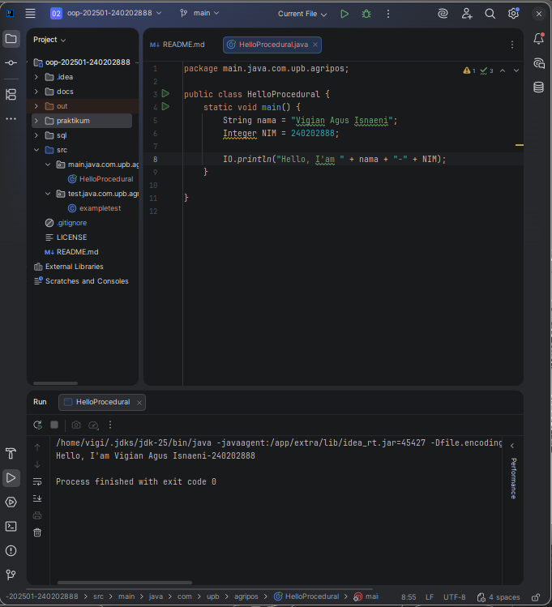
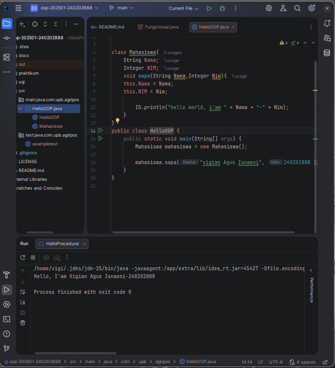
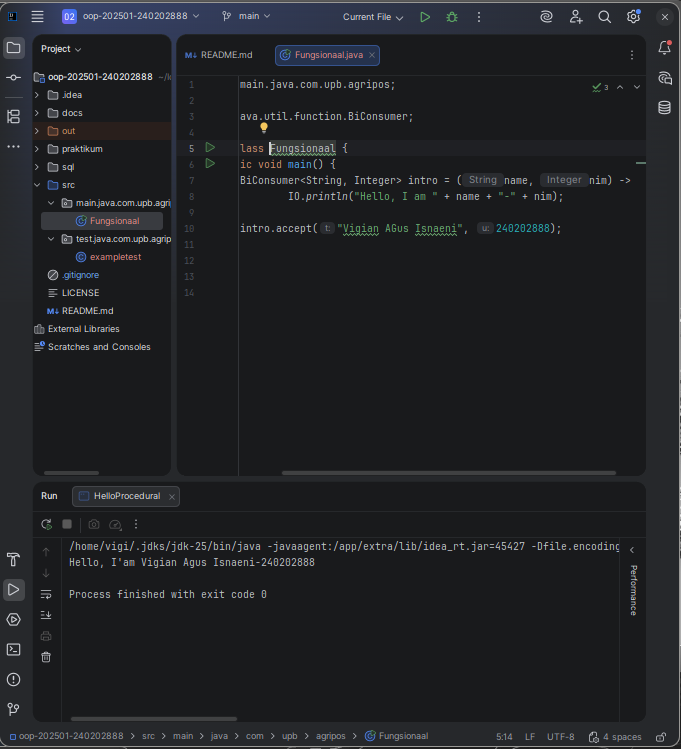

# Laporan Praktikum Minggu 1 (sesuaikan minggu ke berapa?)
Topik: [Tuliskan judul topik, misalnya "Class dan Object"]

## Identitas
- Nama  : Vigian Agus Isnaeni
- NIM   : 240202888
- Kelas : 3IKRB

---

## Tujuan
- Mahasiswa mampu mendefinisikan paradigma prosedural, OOP, dan fungsional.
- Mahasiswa mampu membandingkan kelebihan dan keterbatasan tiap paradigma.
- Mahasiswa mampu memberikan contoh program sederhana untuk masing-masing paradigma.
- Mahasiswa aktif dalam diskusi kelas (bertanya, menjawab, memberi opini).

---

## Dasar Teori
1. Paradigma pemrograman adalah cara pandang dalam menyusun program:
2. **Prosedural**: program dibangun sebagai rangkaian perintah (fungsi/prosedur).
3. **OOP (Object-Oriented Programming)**: program dibangun dari objek yang memiliki data (atribut) dan perilaku (method).
4. **Fungsional**: program dipandang sebagai pemetaan fungsi matematika, lebih menekankan ekspresi dan transformasi data.

---

## Langkah Praktikum
1. **Setup Project**
    - Pastikan sudah menginstall **JDK** (Java Development Kit), **IDE** (misal: IntelliJ IDEA, VS Code, NetBeans), **Git**, **PostgreSQL**, dan **JavaFX** di komputer.
    - Buat folder project `oop-pos-<nim>`.
    - Inisialisasi repositori Git.
    - Buat struktur awal `src/main/java/com/upb/agripos/`.
    - Pastikan semua tools dapat berjalan (uji dengan membuat dan menjalankan program Java sederhana).

2. **Program Sederhana dalam 3 Paradigma**
    - Prosedural: program untuk menghitung total harga dua produk.
    - OOP: class `Produk` dengan atribut nama dan harga, buat minimal tiga objek, lalu hitung total.
    - Fungsional: gunakan `Stream` atau lambda untuk menghitung total harga dari minimal tiga objek.

3. **Commit dan Push**
    - Commit dengan pesan: `week1-setup-hello-pos`.

---

## Kode Program
Prosedural
```java
IO.println("Hello, I'am " + nama + "-" + NIM);
```

OOP
```java
class Mahasiswa{
    String Nama;
    Integer NIM;
    void sapa(String Nama,Integer Nim){
        this.Nama = Nama;
        this.NIM = Nim;

        IO.println("hello world, i'am " + Nama + "-" + Nim);
    }
}
```
fungsional
```java
BiConsumer<String, Integer> intro = (name, nim) ->
IO.println("Hello, I am " + name + "-" + nim);
```
---

## Hasil Eksekusi
- HelloProcedural
  
- HelloOOP
  
- HelloFunctional
  
---

## Analisis
(
- Cara kerja kode:
    - Pada paradigma prosedural, kode hanya berupa urutan instruksi secara runtut.
    - Pada paradigma OOP, kode dibungkus dalam class mahasiswa sehingga data (nama, NIM) dan perilaku (introduce()) disatukan.
    - Pada paradigma fungsional, digunakan lambda expression dan functional interface (BiConsumer) untuk mencetak pesan dengan dua parameter.

- Perbedaan dengan minggu sebelumnya:
    - Minggu ini mulai diperkenalkan perbedaan paradigma, tidak hanya menulis instruksi sederhana.
    - Pendekatan OOP membuat program lebih terstruktur, sedangkan functional membuat kode lebih ringkas.
- Kendala:
     -  - -
)
---

## Kesimpulan
- Paradigma prosedural cocok untuk program sederhana dan cepat dibuat.
- Paradigma OOP memberikan struktur yang jelas dengan memanfaatkan class dan object, sehingga program lebih mudah dikembangkan.
- Paradigma fungsional membuat kode lebih ringkas dan mengurangi boilerplate dengan memanfaatkan lambda expression. 
---

## Quiz
1. Apakah OOP selalu lebih baik dari prosedural?
   **Jawaban:**
Tidak selalu. OOP cocok jika kita ingin membuat program yang menyerupai dunia nyata—dengan objek, data, dan perilaku yang saling terhubung.
Namun, untuk program kecil atau tugas sederhana (seperti script otomatisasi), paradigma prosedural lebih cepat dan mudah karena tidak perlu membuat class dan objek.

2. Kapan functional programming lebih cocok digunakan dibanding OOP atau prosedural?
   **Jawaban:**
Functional programming lebih cocok digunakan saat:
 a. Program perlu berjalan paralel atau konkuren, karena fungsi murni tidak saling memengaruhi. 
 b. Dibutuhkan keandalan tinggi dan bug harus diminimalkan. 
 c. Digunakan untuk pemrosesan data besar, seperti ETL, AI/ML pipeline, atau sistem berbasis event.
 d. Ingin menghindari struktur class yang rumit, dan fokus pada komposisi fungsi yang sederhana.

3. Bagaimana paradigma (prosedural, OOP, fungsional) memengaruhi maintainability dan scalability aplikasi?
   **Jawaban:**
Prosedural: Mudah dipahami untuk program kecil, tapi sulit dirawat kalau aplikasinya besar, karena logika dan data sering tercampur.
OOP: Lebih mudah dirawat dan dikembangkan karena kode terstruktur dalam class dan objek. Cocok untuk aplikasi besar dan jangka panjang.
Fungsional: Mudah diuji dan dikembangkan karena setiap fungsi berdiri sendiri dan tidak mengubah data di luar dirinya. Cocok untuk sistem data besar atau aplikasi paralel.

4. Mengapa OOP lebih cocok untuk mengembangkan aplikasi POS dibanding prosedural?
   **Jawaban:**
Karena aplikasi POS memiliki banyak objek yang saling berhubungan seperti Produk, Transaksi, Kasir, dan Pelanggan.
Dengan OOP Data dan perilaku bisa digabung dalam satu class (misalnya class Transaksi punya method hitungTotal()).
Hubungan antar-objek jelas (misalnya Transaksi berisi daftar Produk).
Kode jadi lebih rapi, mudah dikembangkan, dan gampang ditambah fitur baru.

6. Bagaimana paradigma fungsional dapat membantu mengurangi kode berulang (boilerplate code)?
    **Jawaban:**
Paradigma fungsional membantu mengurangi kode berulang dengan cara:
Menggunakan fungsi umum seperti map, filter, dan reduce, sehingga tidak perlu menulis loop berulang.
Memakai fungsi murni dan data yang tidak berubah, jadi fungsi bisa digunakan di banyak tempat tanpa efek samping.
Menggabungkan fungsi-fungsi kecil dengan function composition, sehingga kode lebih singkat dan mudah dibaca.