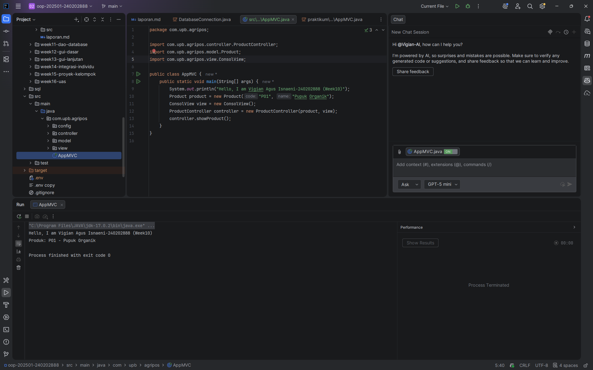
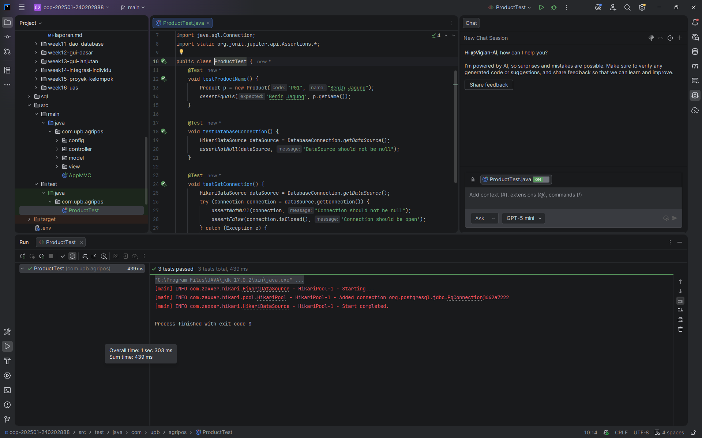

# Laporan Praktikum Minggu 10

Topik: Design Pattern (Singleton, MVC) dan Unit Testing menggunakan JUnit

## Identitas

- Nama  : Vigian Agus Isnaeni
- NIM   : 240202888
- Kelas : 3IKRB

---

## Tujuan

Mahasiswa mampu memahami konsep design pattern, mengimplementasikan Singleton Pattern dan Model–View–Controller (MVC), serta membuat dan menjalankan unit testing menggunakan JUnit guna meningkatkan kualitas perangkat lunak.

---

## Dasar Teori

1. Design pattern adalah solusi desain yang telah teruji untuk menyelesaikan permasalahan umum dalam pengembangan perangkat lunak.
2. Singleton Pattern digunakan untuk memastikan sebuah class hanya memiliki satu instance (contoh: class yang mengelola koneksi database).
3. Model–View–Controller (MVC) memisahkan logika bisnis (Model), tampilan (View), dan pengontrol (Controller) sehingga memudahkan pemeliharaan.
4. Unit testing bertujuan untuk menguji bagian kecil dari program secara terpisah sehingga bug dapat ditemukan lebih awal.
5. JUnit merupakan framework pengujian untuk Java yang umum digunakan untuk menulis dan menjalankan unit test.

---

## Langkah Praktikum

1. Menyiapkan struktur project Java sesuai panduan praktikum Week 10 (folder `src/main/java` dan `src/test/java`).
2. Mengimplementasikan Singleton Pattern pada class `DatabaseConnection` di `src/main/java/com/upb/agripos/config/DatabaseConnection.java`.
3. Menerapkan konsep MVC pada fitur Product yang terdiri dari Model (`Product`), View (`ConsolView`), dan Controller (`ProductController`) di `src/main/java/com/upb/agripos`.
4. Membuat unit test menggunakan JUnit pada `src/test/java/com/upb/agripos/ProductTest.java` untuk menguji `Product` dan koneksi database.
5. Menjalankan unit test dan mendokumentasikan hasil pengujian.
6. Melakukan commit dengan pesan:

   `week10-pattern-testing: implement singleton, mvc, and junit test`

---

## Kode Program

Contoh kode utama yang dibuat 

```java
public class ProductController {
   private final Product model;
   private final ConsolView view;

   public ProductController(Product model, ConsolView view) {
      this.model = model;
      this.view = view;
   }

   public void showProduct() {
      view.showMessage("Produk: " + model.getCode() + " - " + model.getName());
   }
}
```

Contoh kode unit testing 

```java
    @Test
void testProductName() {
   Product p = new Product("P01", "Benih Jagung");
   assertEquals("Benih Jagung", p.getName());
}

@Test
void testDatabaseConnection() {
   HikariDataSource dataSource = DatabaseConnection.getDataSource();
   assertNotNull(dataSource, "DataSource should not be null");
}

@Test
void testGetConnection() {
   HikariDataSource dataSource = DatabaseConnection.getDataSource();
   try (Connection connection = dataSource.getConnection()) {
      assertNotNull(connection, "Connection should not be null");
      assertFalse(connection.isClosed(), "Connection should be open");
   } catch (Exception e) {
      fail("Failed to get connection: " + e.getMessage());
   }
}
```

---

## Hasil Eksekusi

Program berhasil menampilkan data produk pada console dan seluruh unit test yang relevan dijalankan (lihat hasil pada screenshot di bawah).






---

## Analisis

- Singleton pada `DatabaseConnection` memastikan bahwa hanya ada satu instance `HikariDataSource` yang dibuat, sehingga pengelolaan koneksi lebih efisien dan terpusat.
- MVC memisahkan tanggung jawab: `Product` (Model) menyimpan data, `ConsolView` (View) menampilkan data, dan `ProductController` (Controller) mengkoordinasikan interaksi antara model dan view.
- Dibandingkan praktikum sebelumnya, penggunaan pattern membuat kode lebih terstruktur, modular, dan lebih mudah diuji.
- Kendala utama adalah konfigurasi environment untuk database (mis. variabel DB_PASSWORD di .env dan ketersediaan PostgreSQL); mengatasinya dengan memastikan file `.env` berisi kredensial yang benar atau menyesuaikan konfigurasi jika hanya ingin menjalankan unit test yang tidak membuka koneksi nyata.

---

## Kesimpulan

Penerapan Singleton Pattern, MVC, dan unit testing menggunakan JUnit membuat aplikasi lebih terstruktur, mudah dikembangkan, dan meningkatkan keandalan melalui pengujian otomatis.

---

## Quiz

1. Mengapa constructor pada Singleton harus bersifat private?
   **Jawaban:** Agar objek tidak dapat dibuat langsung dari luar class sehingga instance tunggal dapat dikontrol dan hanya diakses melalui method `getDataSource()`/`getInstance()`.

2. Jelaskan manfaat pemisahan Model, View, dan Controller.
   **Jawaban:** Memudahkan pemeliharaan dan pengujian; pengembang dapat mengubah tampilan tanpa mengubah logika bisnis, dan sebaliknya.

3. Apa peran unit testing dalam menjaga kualitas perangkat lunak?
   **Jawaban:** Unit testing membantu mendeteksi regresi dan error lebih awal, memastikan fungsi-fungsi kecil bekerja sesuai spesifikasi.

4. Apa risiko jika Singleton tidak diimplementasikan dengan benar?
   **Jawaban:** Dapat menyebabkan lebih dari satu instance dibuat (mis. pada kondisi race), yang berpotensi menyebabkan pemborosan resource, inkonsistensi state, dan bug yang sulit dideteksi.

