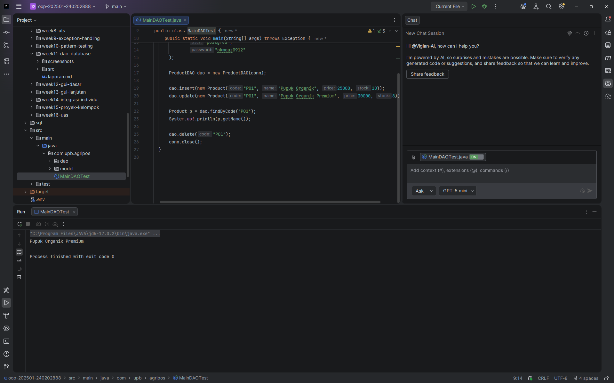

# Laporan Praktikum Minggu 11
Topik: Data Access Object (DAO) dan CRUD Database dengan JDBC

## Identitas
- Nama  : Vigian Agus Isnaeni
- NIM   : 240202888
- Kelas : 3IKRB

---

## Tujuan
1. Menjelaskan konsep Data Access Object (DAO) dalam pengembangan aplikasi OOP.
2. Menghubungkan aplikasi Java dengan basis data menggunakan JDBC.
3. Mengimplementasikan operasi CRUD (Create, Read, Update, Delete) secara lengkap.
4. Mengintegrasikan DAO dengan class aplikasi OOP sesuai prinsip desain yang baik.

---

## Dasar Teori
1. **Data Access Object (DAO)**: Pola desain yang memisahkan logika akses data dari logika bisnis aplikasi. Ini membuat kode lebih terstruktur dan memudahkan penggantian teknologi database tanpa mengubah logika utama.
2. **JDBC (Java Database Connectivity)**: Standar API Java untuk menghubungkan aplikasi dengan basis data relasional. Komponen utamanya meliputi `DriverManager` (mengelola driver), `Connection` (sesi koneksi), `PreparedStatement` (eksekusi query aman), dan `ResultSet` (menampung hasil query).
3. **PreparedStatement**: Interface JDBC yang digunakan untuk mengeksekusi statement SQL yang telah dikompilasi sebelumnya. Ini lebih efisien dan aman dari serangan SQL Injection dibandingkan `Statement` biasa.

---

## Langkah Praktikum
1. **Persiapan Database**: Membuat database `agripos` dan tabel `products` di PostgreSQL.
2. **Membuat Model**: Membuat class `Product.java` sebagai representasi objek data.
3. **Membuat Interface DAO**: Mendefinisikan kontrak operasi CRUD di `ProductDAO.java`.
4. **Implementasi DAO**: Mengimplementasikan logika database JDBC di `ProductDAOImpl.java` menggunakan `PreparedStatement`.
5. **Integrasi & Pengujian**: Membuat class `MainDAOTest.java` untuk menjalankan skenario CRUD (Insert -> Update -> Read -> Delete) dan memverifikasi hasilnya.
6. Melakukan commit dengan pesan:

   `week11-dao-database: fitur implementasi DAO dan CRUD database`

---

## Kode Program

Contoh potongan implementasi sesuai `src` proyek:

**`ProductDAOImpl.java` (interface)**
```java
void insert(Product product) throws Exception;
Product findByCode(String code) throws Exception;
List<Product> findAll() throws Exception;
void update(Product product) throws Exception;
void delete(String code) throws Exception;
```

**`ProductDAO.java` (implementasi utama - method insert)**
```java
@Override
public void insert(Product p) throws Exception {
    String sql = "INSERT INTO products(code, name, price, stock) VALUES (?, ?, ?, ?)";
    try (PreparedStatement ps = connection.prepareStatement(sql)) {
        ps.setString(1, p.getCode());
        ps.setString(2, p.getName());
        ps.setDouble(3, p.getPrice());
        ps.setInt(4, p.getStock());
        ps.executeUpdate();
    }
}
```

**`MainDAOTest.java` (cara menjalankan dan koneksi yang dipakai di repo)**
```java
Connection conn = DriverManager.getConnection(
    "jdbc:postgresql://localhost:5432/OOP",
    "postgres",
    "okmqaz0912"
);
ProductDAO dao = new ProductDAO(conn);
```

Catatan: method pada implementasi melempar `Exception` sehingga `MainDAOTest` menanganinya (dalam kode repo `main` method dideklarasikan `throws Exception`).

---

## Hasil Eksekusi  


---

## Analisis

Berdasarkan kode yang ada di `src` (implementasi `ProductDAO` dan `MainDAOTest`), beberapa pengamatan teknis:

- Struktur proyek: interface `ProductDAOImpl` mendefinisikan kontrak CRUD, sementara `ProductDAO` menyediakan implementasi berbasis JDBC—ini sesuai prinsip pemisahan tanggung jawab.
- Penanganan error: metode melempar `Exception` ke pemanggil sehingga kelas tester (`MainDAOTest`) dapat memilih strategi penanganan (pada repo saat ini `main` melempar Exception lebih lanjut).
- Konektivitas: koneksi dibuat langsung lewat `DriverManager` dengan URL `jdbc:postgresql://localhost:5432/OOP` dan kredensial `postgres`/`okmqaz0912` (ditetapkan di `MainDAOTest`). Untuk penggunaan nyata sebaiknya simpan kredensial di konfigurasi, jangan di-hardcode.
- Operasional CRUD: `MainDAOTest` menunjukkan alur insert -> update -> baca -> delete, yang cocok untuk validasi fungsional CRUD; akibatnya, jika data lama tidak dibersihkan, operasi insert dapat menimbulkan `Duplicate Key`.
- Praktik yang dapat ditingkatkan: tambah validasi eksistensi sebelum insert, gunakan id auto-increment bila sesuai, gunakan connection pooling (mis. HikariCP) dan logging terstruktur alih-alih `printStackTrace`.

---

## Kesimpulan

Penerapan DAO dengan JDBC berhasil menunjukan cara terstruktur untuk mengelola operasi CRUD dan membuat kode lebih mudah diuji. Pendekatan ini meningkatkan keteraturan kode dan keamanan query, namun menuntut pengelolaan koneksi dan strategi penanganan duplikasi yang baik. Langkah selanjutnya yang direkomendasikan adalah menerapkan connection pooling, menambahkan validasi eksistensi data sebelum insert, dan memperbaiki logging/penanganan error untuk produksi.

