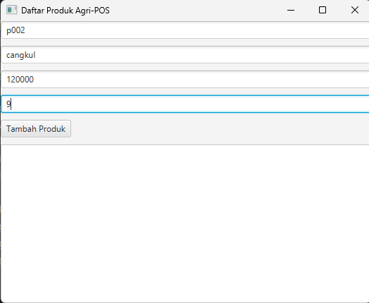
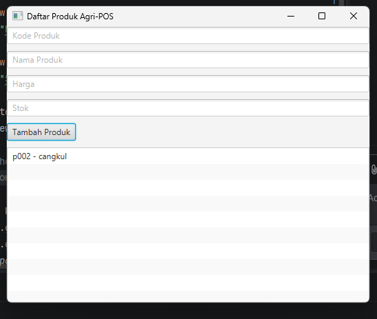

# Laporan Praktikum Minggu 12
Topik: GUI Dasar JavaFX (Event-Driven Programming)

## Identitas
- Nama  : Vigian Agus Isnaeni
- NIM   : 240202888
- Kelas : 3IKRB

---

## Tujuan
1. Menjelaskan konsep event-driven programming.
2. Membangun antarmuka grafis sederhana menggunakan JavaFX.
3. Membuat form input data produk.
4. Menampilkan daftar produk pada GUI.
5. Mengintegrasikan GUI dengan modul backend yang telah dibuat (DAO & Service).

---

## Dasar Teori
1. **Event-Driven Programming**: Paradigma pemrograman di mana alur eksekusi program ditentukan oleh kejadian (event) seperti klik mouse, penekanan tombol keyboard, atau input pengguna lainnya.
2. **JavaFX**: Platform perangkat lunak untuk membuat dan mengirimkan aplikasi desktop serta aplikasi internet kaya (RIA) yang dapat berjalan di berbagai perangkat.
3. **MVC (Model-View-Controller)**: Pola desain arsitektur yang memisahkan aplikasi menjadi tiga komponen utama: Model (data), View (tampilan), dan Controller (logika penghubung), untuk memudahkan pengelolaan dan pengembangan.
4. **Dependency Injection**: Teknik di mana ketergantungan objek (seperti Service atau DAO) disuntikkan ke dalam objek yang membutuhkannya, bukan dibuat di dalamnya, untuk meningkatkan fleksibilitas dan pengujian.

---

## Langkah Praktikum
1. **Setup Project**: Memastikan library JavaFX terkonfigurasi dengan benar pada project dan VM options ditambahkan bila diperlukan (lihat komentar di `AppJavaFX.java`).
2. **Membuat Layout GUI**: Mengimplementasikan UI langsung di `AppJavaFX.java` (TextField: Kode, Nama, Harga, Stok; Button: Tambah Produk; ListView untuk tampilan).
3. **Implementasi Controller (opsional)**: `ProductController.java` disediakan dengan konstruktor yang menerima `TextField`, `Button`, `ListView`, dan `ProductService`; apabila digunakan, controller akan meng-initialize event handler.
   - Signature aktual: `public ProductController(TextField txtCode, TextField txtName, TextField txtPrice, TextField txtStock, Button btnAdd, ListView<String> listView, ProductService productService)`
4. **Integrasi Backend**: `AppJavaFX` saat ini meng-instantiate `ProductService` secara langsung (`new ProductService()`); `ProductService` menyimpan data di memori (`ArrayList<Product>`). Implementasi JDBC (`ProductDAOImpl`) terdapat di folder `dao` tetapi belum dipakai langsung oleh `AppJavaFX`.
5. **Event Handling**: Menambahkan handler pada `btnAdd` yang membuat objek `Product`, memanggil `productService.insert(p)`, memperbarui `ListView`, dan membersihkan form; `AppJavaFX` menambahkan penanganan `NumberFormatException` dengan `Alert`.
6. **Commit dan Push**: Menyimpan perubahan ke repository dengan pesan `week12-gui-dasar: implement basic javafx gui for product entry`.

---

## Kode Program
Berikut adalah potongan kode implementasi event handler sesuai dengan implementasi pada `AppJavaFX.java` (dikomentari agar aman untuk ditampilkan di laporan):

```java

 private final ProductService productService = new ProductService();

 Handler btnAdd di AppJavaFX
 btnAdd.setOnAction(event -> {
     try {
         Product p = new Product(
             txtCode.getText(),
             txtName.getText(),
             Double.parseDouble(txtPrice.getText()),
             Integer.parseInt(txtStock.getText())
         );
         productService.insert(p); // menyimpan ke list di ProductService (in-memory)
         listView.getItems().add(p.getCode() + " - " + p.getName());
         txtCode.clear(); txtName.clear(); txtPrice.clear(); txtStock.clear();
     } catch (NumberFormatException e) {
         Alert alert = new Alert(Alert.AlertType.ERROR, "Harga dan Stok harus berupa angka.", ButtonType.OK);
         alert.showAndWait();
     }
 });
```

---

## Hasil Eksekusi
Tampilan GUI Form Produk yang telah berjalan 



---

## Analisis
- **Event-Driven**: Implementasi di `AppJavaFX` mengikuti pola event-driven; aplikasi menunggu interaksi pengguna dan mengeksekusi handler saat event terjadi.
- **Integrasi Backend Saat Ini**: `AppJavaFX` menggunakan `ProductService` berbasis memori (List) — `ProductService.insert()` menambahkan objek `Product` ke ArrayList. Meskipun `ProductDAOImpl` (JDBC) tersedia, GUI belum menggunakannya langsung; untuk koneksi ke DB, `ProductService` perlu diperluas untuk memanggil `ProductDAO`.
- **Controller**: `ProductController` menerima dependensi (TextField, Button, ListView, ProductService) melalui konstruktor sehingga mempermudah testing dan pemisahan view/controller.
- **Validasi Input**: Pada level GUI ditangani `NumberFormatException` untuk memastikan harga dan stok berupa angka; validasi lebih lengkap (mis. non-empty kode) bisa ditambahkan.
- **Kendala Teknis**: Menjalankan operasi DB di thread UI akan mengurangi responsivitas; bila `ProductService` disambungkan ke `ProductDAOImpl`, operasi berat harus dijalankan di background thread (Task) dan hasilnya di-post ke UI thread.

---

## Kesimpulan
Praktikum ini menunjukkan implementasi GUI sederhana menggunakan JavaFX yang terhubung ke lapisan service di aplikasi. Pada kode repo saat ini, data disimpan di memory lewat `ProductService`; `ProductDAOImpl` untuk JDBC tersedia namun belum diintegrasikan. 

---

## Traceability Bab 6 (UML) -> GUI

| Artefak Bab 6 | Referensi | Handler GUI | Controller/Service | DAO | Dampak UI/DB |
|---|---|---|---|---|---|
| Use Case | UC-01 Tambah Produk | Tombol Tambah | `ProductController.add()` → `ProductService.insert()` | `ProductDAO.insert()` | UI list bertambah + DB insert |
| Activity | AD-01 Tambah Produk | Tombol Tambah | Validasi input & panggil service | `insert()` | validasi → simpan → tampil |
| Sequence | SD-01 Tambah Produk | Tombol Tambah | View→Controller→Service | DAO→DB | urutan panggilan sesuai SD |

---
