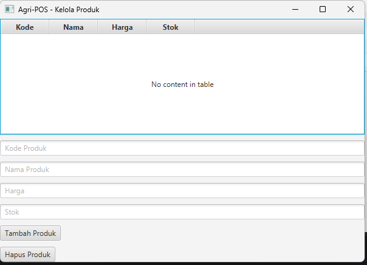

# Laporan Praktikum Minggu 13
Topik: GUI Lanjutan JavaFX (TableView dan Lambda Expression)

## Identitas
- Nama  : Vigian Agus Isnaeni
- NIM   : 240202888
- Kelas : 3IKRB

---

## Tujuan
1. Menampilkan data menggunakan TableView JavaFX.
2. Mengintegrasikan koleksi objek dengan GUI.
3. Menggunakan lambda expression untuk event handling.
4. Menghubungkan GUI dengan lapisan service/DAO secara sederhana.
5. Membangun antarmuka GUI Agri-POS yang lebih interaktif.

---

## Langkah Praktikum
1. **Setup Project**: Pastikan dependensi JavaFX tersedia (run configuration harus menyertakan --module-path dan --add-modules jika diperlukan).
2. **Implementasi Model**: Membuat class `Product` dengan property JavaFX (StringProperty, DoubleProperty, IntegerProperty).
3. **Implementasi Service**: Membuat `ProductService` sederhana yang menyimpan data dalam list (sebagai mock DAO untuk praktikum ini).
4. **Implementasi View & App**: Membuat `AppJavaFX` yang menyiapkan `TableView`, input field dan tombol.
5. **Implementasi Controller**: Membuat `ProductController` untuk meng-handle penambahan, penghapusan, dan pengisian data ke `TableView`.
6. **Integrasi**: Menghubungkan handler dengan lambda expression di `AppJavaFX` dan memuat data awal.
7. **Commit dan Push**: Menyimpan perubahan ke repository dengan pesan `week13-gui-lanjutan: implement gui with tableview and lambda expression`.

---

## Ringkasan Implementasi 

- Model `Product` 

```java
// com.upb.agripos.model.Product
public class Product {
    private final StringProperty code;
    private final StringProperty name;
    private final DoubleProperty price;
    private final IntegerProperty stock;

    public Product(String code, String name, double price, int stock) {
        this.code = new SimpleStringProperty(code);
        this.name = new SimpleStringProperty(name);
        this.price = new SimpleDoubleProperty(price);
        this.stock = new SimpleIntegerProperty(stock);
    }

    // property accessors untuk binding ke TableView
    public StringProperty codeProperty() { return code; }
    public StringProperty nameProperty() { return name; }
    public DoubleProperty priceProperty() { return price; }
    public IntegerProperty stockProperty() { return stock; }

    // getter / setter (sederhana)
    public String getCode() { return code.get(); }
    public String getName() { return name.get(); }
    public double getPrice() { return price.get(); }
    public int getStock() { return stock.get(); }

    public void setName(String name) { this.name.set(name); }
    public void setPrice(double price) { this.price.set(price); }
    public void setStock(int stock) { this.stock.set(stock); }
}
```

- Service `ProductService`

```java
// com.upb.agripos.service.ProductService
public class ProductService {
    private List<Product> products;

    public ProductService() {
        this.products = new ArrayList<>();
    }

    public void insert(Product product) { products.add(product); }
    public void delete(Product product) { products.remove(product); }
    public List<Product> getAllProducts() { return products; }
}
```

- Controller `ProductController`:

```java
// com.upb.agripos.controller.ProductController
public class ProductController {
    private final TextField txtCode;
    private final TextField txtName;
    private final TextField txtPrice;
    private final TextField txtStock;
    private final Button btnAdd;
    private final ListView<String> listView;
    private final ProductService productService;

    public ProductController(TextField txtCode, TextField txtName, TextField txtPrice, TextField txtStock, Button btnAdd, ListView<String> listView, ProductService productService) {
        this.txtCode = txtCode;
        this.txtName = txtName;
        this.txtPrice = txtPrice;
        this.txtStock = txtStock;
        this.btnAdd = btnAdd;
        this.listView = listView;
        this.productService = productService;
    }

    public void addProduct(TextField txtCode, TextField txtName, TextField txtPrice, TextField txtStock, TableView<Product> tableView) {
        try {
            Product product = new Product(
                txtCode.getText(),
                txtName.getText(),
                Double.parseDouble(txtPrice.getText()),
                Integer.parseInt(txtStock.getText())
            );
            productService.insert(product);
            tableView.getItems().add(product);
            clearFields();
        } catch (NumberFormatException e) {
            System.out.println("Invalid input: " + e.getMessage());
        }
    }

    public void deleteProduct(TableView<Product> tableView) {
        Product selectedProduct = tableView.getSelectionModel().getSelectedItem();
        if (selectedProduct != null) {
            productService.delete(selectedProduct);
            tableView.getItems().remove(selectedProduct);
        }
    }

    public void loadData(TableView<Product> tableView) {
        var fresh = productService.getAllProducts();
        var productItems = tableView.getItems();
        if (productItems instanceof javafx.collections.transformation.FilteredList) {
            javafx.collections.ObservableList<Product> src = (javafx.collections.ObservableList<Product>) ((javafx.collections.transformation.FilteredList<Product>) productItems).getSource();
            src.setAll(fresh);
        } else {
            productItems.setAll(fresh);
        }
    }

    private void clearFields() {
        txtCode.clear();
        txtName.clear();
        txtPrice.clear();
        txtStock.clear();
    }
}
```

- Aplikasi utama `AppJavaFX` yang membuat TableView, mengikat kolom, dan memasang lambda handler pada tombol:

```java
// com.upb.agripos.AppJavaFX (ekstrak penting)
tableView = new TableView<>();
TableColumn<Product, String> codeColumn = new TableColumn<>("Kode");
codeColumn.setCellValueFactory(cellData -> cellData.getValue().codeProperty());
// ... kolom lain: name, price, stock

btnAdd.setOnAction(event -> productController.addProduct(txtCode, txtName, txtPrice, txtStock, tableView));
btnDelete.setOnAction(event -> productController.deleteProduct(tableView));

// load awal
productController.loadData(tableView);
```

```java
btnDelete.setOnAction(event -> productController.deleteProduct(tableView));
```

Pada `ProductController.deleteProduct()` implementasinya mengambil item yang dipilih dari `TableView`, memanggil `productService.delete(...)` dan menghapusnya dari `tableView.getItems()`.

Keuntungan pendekatan ini:
- Handler ringkas dan mudah dibaca.
- Logika UI terpusat di controller, memisahkan pembuatan view dan logika bisnis.

---

## Alur Sequence (hapus produk) — sesuai implementasi
1. User klik tombol "Hapus Produk" pada UI.
2. Lambda di `AppJavaFX` memanggil `productController.deleteProduct(tableView)`.
3. `ProductController.deleteProduct()`:
   - Ambil produk terpilih dari `tableView.getSelectionModel().getSelectedItem()`.
   - Jika tidak null, panggil `productService.delete(selectedProduct)` untuk menghapus dari sumber data.
   - Hapus item dari `tableView.getItems()` agar tampilan ter-update.
4. UI menampilkan daftar produk yang sudah di-refresh.

Catatan: Pada implementasi praktikum ini `ProductService` menyimpan data di memory (List). Pada aplikasi nyata langkah 3 biasanya memanggil DAO yang menghapus data di database dan kemudian reload data dari DB.

---

## Traceability Bab 6 (UML) -> GUI (pemetaan ke kode)

| Artefak Bab 6 | Referensi | Handler GUI | Controller/Service | DAO / Sumber Data | Dampak UI/DB |
|---|---:|---|---|---|---|
| Use Case | UC-02 Lihat Daftar Produk | `loadData()` / init view | `ProductController.loadData()` → `ProductService.getAllProducts()` | (in-memory list) | TableView terisi dari sumber data
| Use Case | UC-03 Tambah Produk | Tombol Tambah (`btnAdd`) | `ProductController.addProduct()` → `ProductService.insert()` | (in-memory list) | Data baru tampil di TableView
| Use Case | UC-03 Hapus Produk | Tombol Hapus (`btnDelete`) | `ProductController.deleteProduct()` → `ProductService.delete()` | (in-memory list) | Item dihapus dari sumber dan TableView

---

## Hasil Eksekusi


---

## Analisis
- TableView + JavaFX Property memudahkan binding dan update UI otomatis.
- Lambda expression membuat pengikatan event lebih ringkas dibanding anonymous class.
- Pemisahan tanggung jawab: `AppJavaFX` (view/scene), `ProductController` (UI logic), `ProductService` (data storage) — mempermudah pemeliharaan.
- Keterbatasan praktikum: `ProductService` masih in-memory, sehingga tidak persisten; untuk integrasi nyata gunakan DAO + database.

---

## Kesimpulan
Praktikum berhasil menunjukkan penggunaan `TableView`, JavaFX properties, dan lambda expression untuk event handling. Struktur controller/service membuat kode lebih modular.

---
