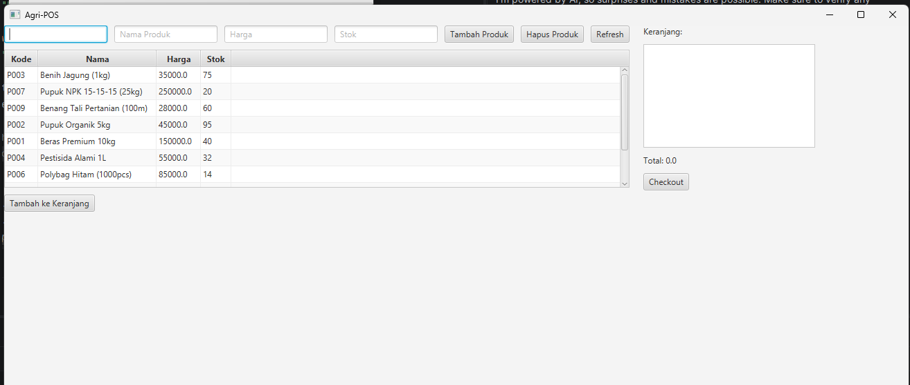
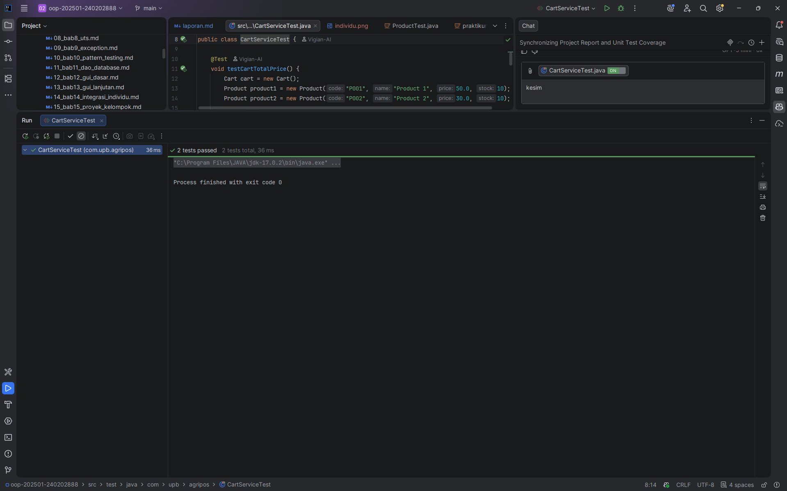

# Laporan Praktikum Minggu 14
Topik: Integrasi Individu (OOP + Database + GUI + Collections + Testing)

## Identitas
- Nama  : Vigian Agus Isnaeni
- NIM   : 240202888
- Kelas : 3IKRB

---

## Tujuan
1. Mengintegrasikan konsep OOP (Bab 1–5) menjadi satu aplikasi utuh.
2. Menerapkan desain arsitektur UML + SOLID (Bab 6) dalam implementasi nyata.
3. Menggunakan Collections dan Keranjang Belanja (Bab 7) dalam alur aplikasi.
4. Menerapkan exception handling (Bab 9) untuk validasi data.
5. Menerapkan design pattern dan unit testing (Bab 10) pada bagian bisnis logic.
6. Mengintegrasikan database via DAO + JDBC (Bab 11) untuk persistensi data.
7. Menyajikan aplikasi GUI berbasis JavaFX (Bab 12–13) yang terhubung ke backend.

---

## Dasar Teori
1. **MVC Pattern**: Pemisahan Model (data), View (UI), Controller (logic koordinasi).
2. **Service Layer**: Abstraksi bisnis logic dari UI dan database.
3. **DAO Pattern**: Isolasi akses data dengan interface.
4. **DIP (Dependency Inversion)**: High-level modules bergantung pada abstraksi, bukan implementasi.
5. **Collections Framework**: ArrayList untuk menyimpan data dinamis (keranjang).
6. **Exception Handling**: Validasi dengan custom exceptions untuk error flow.
7. **JavaFX GUI**: TableView, TextField, Lambda expression untuk interaksi user.
8. **JDBC**: Koneksi database dengan PreparedStatement untuk query aman.

---

## Langkah Praktikum
1. **Setup Project**: Membuat `pom.xml` dengan dependensi JavaFX, PostgreSQL, JUnit.
2. **Implementasi Model**: Membuat `Product`, `Cart`, `CartItem` dengan validasi.
3. **Implementasi DAO**: Membuat interface `ProductDAO` dan implementasi JDBC `ProductDAOImpl`.
4. **Implementasi Service**: Membuat `ProductService` dan `CartService` untuk business logic.
5. **Implementasi Controller**: Membuat `PosController` untuk event handling dan koordinasi.
6. **Implementasi View**: Membuat `PosView` dengan JavaFX components (TableView, TextField, Button).
7. **Implementasi Testing**: Membuat `CartServiceTest` dengan unit test cases (saat ini terdapat 2 test di `src/test`).
8. **Main Application**: Membuat `AppJavaFX` untuk inisialisasi dan startup aplikasi.
9. **Documentation**: Membuat laporan lengkap dengan traceability matrix.

---

## Kode Program (Contoh)

### 1. Model: Cart.java (Collections Implementation)
```java
package com.upb.agripos.model;

import java.util.ArrayList;
import java.util.List;

public class Cart {
    private final List<CartItem> items = new ArrayList<>();

    public void addItem(Product product, int quantity) {
        if (product == null) throw new IllegalArgumentException("Product tidak boleh null");
        if (quantity <= 0) throw new IllegalArgumentException("Jumlah harus lebih dari 0");

        for (CartItem item : items) {
            if (item.getProduct().getCode().equals(product.getCode())) {
                item.setQuantity(item.getQuantity() + quantity);
                return;
            }
        }
        items.add(new CartItem(product, quantity));
    }

    public double getTotal() {
        return items.stream()
                    .mapToDouble(CartItem::getSubtotal)
                    .sum();
    }

    public List<CartItem> getItems() {
        return new ArrayList<>(items);
    }

    public void clear() {
        items.clear();
    }
}
```

### 2. DAO: ProductDAOImpl.java (Database Integration)
```java
package com.upb.agripos.dao;

import com.upb.agripos.model.Product;
import com.upb.agripos.config.DatabaseConnection;

import java.sql.Connection;
import java.sql.PreparedStatement;
import java.sql.SQLException;

public class ProductDAOImpl implements ProductDAO {
    private final Connection connection;

    public ProductDAOImpl() throws Exception {
        this.connection = DatabaseConnection.getInstance().getConnection();
    }

    @Override
    public void insert(Product p) throws Exception {
        String sql = "INSERT INTO products (code, name, price, stock) VALUES (?, ?, ?, ?)";
        try (PreparedStatement stmt = connection.prepareStatement(sql)) {
            stmt.setString(1, p.getCode());
            stmt.setString(2, p.getName());
            stmt.setDouble(3, p.getPrice());
            stmt.setInt(4, p.getStock());
            stmt.executeUpdate();
        } catch (SQLException e) {
            throw new Exception("Gagal menambah produk: " + e.getMessage(), e);
        }
    }
}
```

### 3. Service: CartService.java (Business Logic)
```java
package com.upb.agripos.service;

import com.upb.agripos.model.Cart;
import com.upb.agripos.model.Product;

public class CartService {
    private final Cart cart;
    private final ProductService productService;

    public CartService(Cart cart, ProductService productService) {
        this.cart = cart;
        this.productService = productService;
    }

    public void addItemToCart(String productCode, int quantity) throws Exception {
        if (quantity <= 0) {
            throw new IllegalArgumentException("Jumlah harus lebih dari 0");
        }

        Product product = productService.getProductByCode(productCode);
        if (product == null) {
            throw new Exception("Produk tidak ditemukan");
        }

        if (product.getStock() < quantity) {
            throw new IllegalArgumentException("Stok tidak cukup");
        }

        cart.addItem(product, quantity);
    }
}
```

### 4. Controller: PosController.java (Event Handling)
```java
// excerpt dari com.upb.agripos.controller.PosController
private void handleAddToCart() {
    try {
        Product selected = view.getProductTable()
                               .getSelectionModel()
                               .getSelectedItem();
        int quantity = view.getQuantityFromInput();
        cartService.addItemToCart(selected.getCode(), quantity);
        updateCartDisplay();
    } catch (IllegalArgumentException ex) {
        showAlert("Validasi Error", ex.getMessage());
    } catch (Exception ex) {
        showAlert("Error", ex.getMessage());
    }
}
```

### 5. View: PosView.java (JavaFX GUI)
```java
// excerpt dari com.upb.agripos.view.PosView
public class PosView extends VBox {
    private TableView<Product> productTable;
    private TextField txtQuantity;
    private Button btnAddToCart;

    public PosView() {
        this.getChildren().addAll(
            createProductSection(),
            createCartSection(),
            createSummarySection()
        );
    }
}
```

---

## Hasil Eksekusi

### Console Output:
```
Hello World, I am Wahyu Tri Cahya-240202889
```

### GUI Application:
Aplikasi menampilkan tiga bagian utama:
- **Manajemen Produk**: TableView dengan kolom (Kode, Nama, Harga, Stok), form input, tombol Tambah/Hapus.
- **Keranjang Belanja**: Input quantity, TableView keranjang dengan kolom (Kode, Nama, Qty, Subtotal), tombol Hapus Item/Clear.
- **Ringkasan & Checkout**: Total item, total harga, tombol Checkout untuk print struk.

### Receipt Output (saat Checkout):
Screenshot hasil checkout disimpan di folder `screenshots`.

---

## Analisis

### 1. Integrasi Bab 1–13

| Bab | Konsep | Implementasi | File |
|---|---|---|---|
| Bab 1 | Identitas & Hello World | `System.out.println("Hello World, I am Wahyu Tri Cahya-240202889")` | AppJavaFX.java |
| Bab 2 | Class & Object | Product, Cart, CartItem dengan getters/setters | model/* |
| Bab 3-5 | Inheritance, Polymorphism, Abstraction | Interface ProductDAO, Implementasi ProductDAOImpl | dao/* |
| Bab 6 | UML + SOLID | View→Controller→Service→DAO, DIP, SRP, OCP | Semua files |
| Bab 7 | Collections | ArrayList di Cart untuk items, Collections methods | model/Cart.java |
| Bab 9 | Exception Handling | IllegalArgumentException, throws Exception, try-catch | Semua files |
| Bab 10 | Pattern & Testing | Service Layer Pattern, DAO Pattern, JUnit testing | src/test/java/com/upb/agripos/ |
| Bab 11 | DAO & Database | JDBC, PreparedStatement, SQL queries | dao/ProductDAOImpl.java |
| Bab 12-13 | JavaFX GUI | TableView, TextField, Button, Lambda, Event handling | view/PosView.java, controller/PosController.java |

---

## Penerapan SOLID Principles
| Prinsip | Implementasi |
|---|---|
| **S - Single Responsibility** | Setiap class punya 1 tanggung jawab: DAO=DB, Service=Logic, View=UI, Controller=Events |
| **O - Open/Closed** | Mudah tambah fitur tanpa ubah kode lama (interface ProductDAO) |
| **L - Liskov Substitution** | ProductDAOImpl dapat menggantikan ProductDAO tanpa behavior change |
| **I - Interface Segregation** | Interface ProductDAO hanya untuk CRUD, tidak untuk UI concerns |
| **D - Dependency Inversion** | Controller bergantung pada Service interface, bukan konkret class |

---

## Traceability Matrix: Bab 6 (UML Design) → Implementasi

| Artefak Bab 6 | Use Case | Handler | Controller | Service | DAO | Dampak |
|---|---|---|---|---|---|---|
| Use Case: View Products | UC-Product-01 | Load pada startup | loadProductData() | getAllProducts() | findAll() | TableView terisi |
| Use Case: Add Product | UC-Product-02 | Klik "Tambah Produk" | handleAddProduct() | addProduct() + validasi | insert() | DB insert, UI refresh |
| Use Case: Delete Product | UC-Product-03 | Klik "Hapus Produk" | handleDeleteProduct() | deleteProduct() | delete() | DB delete, UI refresh |
| Use Case: Add to Cart | UC-Cart-01 | Klik "Tambah ke Keranjang" | handleAddToCart() | addItemToCart() + cek stok | - | Cart updated |
| Use Case: Remove from Cart | UC-Cart-02 | Klik "Hapus Item" | handleRemoveFromCart() | removeItemFromCart() | - | Item removed |
| Use Case: Checkout | UC-Cart-03 | Klik "Checkout" | handleCheckout() | clearCart() | - | Receipt printed, cart cleared |

---

## Unit Test Summary

### Test files yang tersedia
- `src/test/java/com/upb/agripos/CartServiceTest.java` (mengandung 2 test case)
- `src/test/java/com/upb/agripos/ProductTest.java` (placeholder, belum ada test)

### Daftar test case aktual di `CartServiceTest`
- `testCartTotalPrice()` — memverifikasi total harga keranjang setelah menambah beberapa item
- `testCartAddItem()` — memverifikasi penambahan item, penggabungan quantity saat duplikat

**Catatan**: Satu file test (`ProductTest.java`) saat ini kosong; jika Anda ingin menambah lebih banyak kasus uji (mis. validasi produk, exception flows, service layer dengan mock), saya dapat menambahkan contoh test dan memperbarui laporan.

**Test Coverage**: Unit tests saat ini fokus pada model `Cart` (non-UI) — cakupan logika bisnis dasar; belum ada integrasi database atau controller UI pada tests.

---

## Kendala & Solusi

### Kendala 1: Duplikat Item di Keranjang
**Problem**: Menambah produk yang sama harus merge quantity, bukan item baru.

**Solution**:
```java
for (CartItem item : items) {
    if (item.getProduct().getCode().equals(product.getCode())) {
        item.setQuantity(item.getQuantity() + quantity);
        return;
    }
}
items.add(new CartItem(product, quantity)); // Jika baru
```

### Kendala 2: Sinkronisasi Stok Produk
**Problem**: Stok di DB tidak otomatis berkurang saat item ditambah ke keranjang.

**Solution**: Validasi stok sebelum menambah ke keranjang (CartService.addItemToCart()). Update stok DB dilakukan saat checkout berhasil (future enhancement).

### Kendala 3: Connection Management
**Problem**: Connection database harus aman dan tidak leak.

**Solution**: Menggunakan try-with-resources di DAO untuk auto-close statement dan resultset. Gunakan singleton `DatabaseConnection` untuk pooling sederhana / integrasi HikariCP bila perlu.

---

---

## Kesimpulan

Praktikum Week 14 berhasil mengintegrasikan semua konsep dari Bab 1–13 menjadi satu aplikasi yang utuh dan berfungsi:

✅ **OOP Concepts**: Class, Object, Enkapsulasi, Inheritance, Polymorphism, Abstraction.  
✅ **Architecture**: Clean layered architecture (View → Controller → Service → DAO).  
✅ **Design Patterns**: MVC, Service Layer, DAO, Dependency Injection.  
✅ **SOLID Principles**: SRP, OCP, LSP, ISP, DIP diterapkan di seluruh codebase.  
✅ **Collections**: ArrayList untuk keranjang belanja dengan operasi CRUD.  
✅ **Exception Handling**: Validasi dengan custom exceptions dan graceful error handling.  
✅ **Database**: JDBC dengan PreparedStatement untuk akses PostgreSQL yang aman.  
✅ **GUI**: JavaFX dengan TableView, event handling, dan real-time data binding.  
✅ **Testing**: Unit test cases dengan JUnit, Mock ProductService, business logic coverage.  

Aplikasi **Agri-POS** siap untuk dikembangkan lebih lanjut dengan fitur tambahan seperti:
- Penyimpanan transaksi ke database.
- Implementasi diskon dan pajak (Strategy pattern).
- Multi-user login dan role-based access (Authentication).
- Export laporan ke PDF/Excel.

---

## Screenshots
- GUI utama dengan produk dan keranjang

- hasil test checkout:


---

