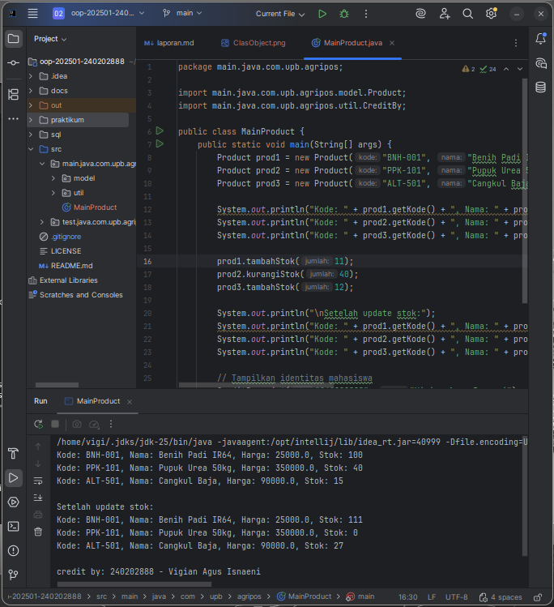

# Laporan Praktikum Minggu 2

**Topik:** Class dan Object (Produk Pertanian)

## Identitas

- **Nama:** Vigian Agus Isnaeni
- **NIM:** 240202888
- **Kelas:** 3IKRB

---

## Tujuan

- Mahasiswa mampu **menjelaskan konsep class, object, atribut, dan method** dalam OOP.
- Mahasiswa mampu **menerapkan access modifier dan enkapsulasi** dalam pembuatan class.
- Mahasiswa mampu **mengimplementasikan class Produk pertanian** dengan atribut dan method yang sesuai.
- Mahasiswa mampu **mendemonstrasikan instansiasi object** serta menampilkan data produk pertanian di console.
- Mahasiswa mampu **menyusun laporan praktikum** dengan bukti kode, hasil eksekusi, dan analisis sederhana.

---

## Dasar Teori

1. **Class** adalah blueprint atau cetak biru dari sebuah objek.
2. **Object** adalah instansiasi dari class yang berisi atribut (data) dan method (perilaku).
3. **Enkapsulasi** digunakan untuk menyembunyikan data menggunakan access modifier (`public`, `private`, `protected`) serta menyediakan akses melalui **getter** dan **setter**.

---

## Langkah Praktikum

1. **Membuat Class Produk**
    - Buat file `Produk.java` pada package `model`.
    - Tambahkan atribut: `kode`, `nama`, `harga`, dan `stok`.
    - Gunakan enkapsulasi dengan menjadikan atribut bersifat private dan membuat getter serta setter untuk masing-masing atribut.

2. **Membuat Class CreditBy**
    - Buat file `CreditBy.java` pada package `util`.
    - Isi class dengan method statis untuk menampilkan identitas mahasiswa di akhir output:
      `credit by: 240202889 - Wahyu Tri Cahya`.

3. **Membuat Objek Produk dan Menampilkan Credit**
    - Buat file `MainProduk.java`.
    - Instansiasi minimal tiga objek produk, misalnya "Benih Padi", "Pupuk Urea", dan satu produk alat pertanian.
    - Tampilkan informasi produk melalui method getter.
    - Panggil `CreditBy.print("240202889", "Wahyu Tri Cahya")` di akhir main.

4. **Commit dan Push**

    - Commit dengan pesan: `week2-class-object`.

---

## Kode Program

### Produk.java

```java
package com.upb.agripos.model;

public class Produk {
    private String kode;
    private String nama;
    private double harga;
    private int stok;

    public Produk(String kode, String nama, double harga, int stok) {
        this.kode = kode;
        this.nama = nama;
        this.harga = harga;
        this.stok = stok;
    }

    public String getKode() { return kode; }
    public void setKode(String kode) { this.kode = kode; }

    public String getNama() { return nama; }
    public void setNama(String nama) { this.nama = nama; }

    public double getHarga() { return harga; }
    public void setHarga(double harga) { this.harga = harga; }

    public int getStok() { return stok; }
    public void setStok(int stok) { this.stok = stok; }

    public void tambahStok(int jumlah) {
        this.stok += jumlah;
    }

    public void kurangiStok(int jumlah) {
        if (this.stok >= jumlah) {
            this.stok -= jumlah;
        } else {
            System.out.println("Stok tidak mencukupi!");
        }
    }
}
```

### CreditBy.java

```java
package com.upb.agripos.util;

public class CreditBy {
    public static void print(String nim, String nama) {
        System.out.println("\ncredit by: " + nim + " - " + nama);
    }
}
```

### MainProduk.java

```java
package com.upb.agripos;

import com.upb.agripos.model.Produk;
import com.upb.agripos.util.CreditBy;

public class MainProduk {
    public static void main(String[] args) {
        Produk p1 = new Produk("BNH-001", "Benih Padi IR64", 25000, 100);
        Produk p2 = new Produk("PPK-101", "Pupuk Urea 50kg", 350000, 40);
        Produk p3 = new Produk("ALT-501", "Cangkul Baja", 90000, 15);

        System.out.println("Kode: " + p1.getKode() + ", Nama: " + p1.getNama() + ", Harga: " + p1.getHarga() + ", Stok: " + p1.getStok());
        System.out.println("Kode: " + p2.getKode() + ", Nama: " + p2.getNama() + ", Harga: " + p2.getHarga() + ", Stok: " + p2.getStok());
        System.out.println("Kode: " + p3.getKode() + ", Nama: " + p3.getNama() + ", Harga: " + p3.getHarga() + ", Stok: " + p3.getStok());

        // Tambah dan kurangi stok
        p1.tambahStok(50);
        p2.kurangiStok(20);
        p3.tambahStok(10);

        System.out.println("\nSetelah update stok:");
        System.out.println("Kode: " + p1.getKode() + ", Nama: " + p1.getNama() + ", Harga: " + p1.getHarga() + ", Stok: " + p1.getStok());
        System.out.println("Kode: " + p2.getKode() + ", Nama: " + p2.getNama() + ", Harga: " + p2.getHarga() + ", Stok: " + p2.getStok());
        System.out.println("Kode: " + p3.getKode() + ", Nama: " + p3.getNama() + ", Harga: " + p3.getHarga() + ", Stok: " + p3.getStok());

        CreditBy.print("240202889", "Wahyu Tri Cahya");
    }
}
```

---

## Hasil Eksekusi




---

## Analisis Implementasi OOP

### Cara Kerja Program

Program yang dikembangkan **mengimplementasikan paradigma Pemrograman Berorientasi Objek (OOP)**. Data dan fungsionalitas terkait dikelompokkan dalam sebuah **kelas (`class`)** bernama `Produk`.

* Setiap **objek (`object`)** dari kelas `Produk` berfungsi sebagai entitas unik yang menyimpan detail produk seperti **kode, nama, harga, dan jumlah stok**.
* **Keamanan data** dijamin melalui **enkapsulasi**, di mana perubahan pada nilai stok hanya dapat dilakukan secara terkontrol melalui **metode (`method`)** `tambahStok()` dan `kurangiStok()`, tanpa perlu mengakses variabel stok secara langsung.
* Selain itu, terdapat kelas `CreditBy` yang menggunakan **metode statis (`static method`)** `print()` untuk menampilkan identitas pengembang atau mahasiswa.

### Perbedaan dari Implementasi Sebelumnya

Terdapat **pergeseran signifikan dari pendekatan sebelumnya**:

* **Minggu sebelumnya** menggunakan **pendekatan prosedural**, di mana seluruh logika dan data terpusat dalam satu fungsi utama (`main()`).
* **Implementasi saat ini** beralih ke **OOP**, menghasilkan kode yang jauh **lebih modular** dan **lebih mudah dikembangkan** serta diperluas.
* Penerapan **enkapsulasi** juga meningkatkan **keamanan data** dan membuat **struktur kode lebih teratur**.

### Kendala

* **Tidak ditemukan masalah**

---

## Kesimpulan

Pemanfaatan **konsep kelas dan objek** terbukti **meningkatkan struktur program** secara keseluruhan. Pendekatan ini mempermudah proses pengembangan.


---

## Quiz

1. **Mengapa atribut sebaiknya dideklarasikan sebagai private dalam class?** 
    dideklarasikan sebagai private agar **variabel data terlindungi** dari modifikasi langsung oleh bagian luar kelas. Perubahan hanya diizinkan melalui *method* internal yang telah ditetapkan seperti geter dan setter.
2. **Apa fungsi getter dan setter dalam enkapsulasi?** 
     **Getter** digunakan untuk membaca atau mengambil nilai dari sebuah atribut, sementara **Setter** digunakan untuk mengubah atau menetapkan nilai atribut dengan batasan dan kontrol yang aman.
3.  **Bagaimana cara class Produk mendukung pengembangan aplikasi POS yang lebih kompleks?**
     class prouct menjadi dasar untuk **pengembangan aplikasi *Point of Sale* (POS) yang lebih kompleks**. 
---