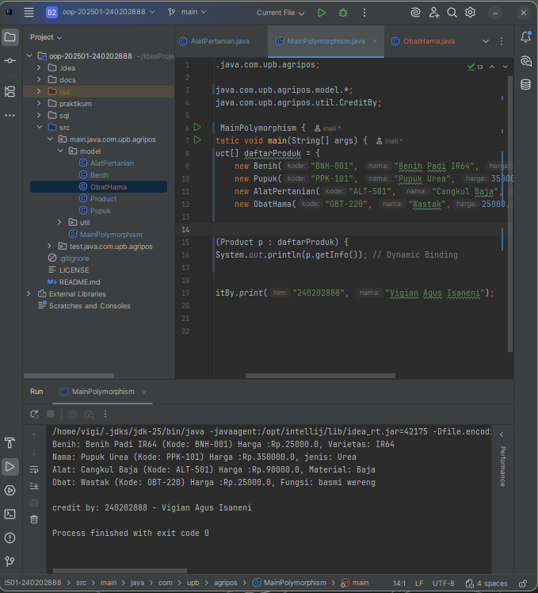

# Laporan Praktikum Minggu 4 (sesuaikan minggu ke berapa?)
Topik: Polymorphism (Info Produk)

## Identitas
- Nama  : Vigian Agus Isnaeni
- NIM   : 240202888
- Kelas : 3IKRB

---

## Tujuan
(- Mahasiswa mampu **menjelaskan konsep polymorphism** dalam OOP.
- Mahasiswa mampu **membedakan method overloading dan overriding**.
- Mahasiswa mampu **mengimplementasikan polymorphism (overriding, overloading, dynamic binding)** dalam program.
- Mahasiswa mampu **menganalisis contoh kasus polymorphism** pada sistem nyata (Agri-POS).

---

## Dasar Teori
Polymorphism berarti “banyak bentuk” dan memungkinkan objek yang berbeda merespons panggilan method yang sama dengan cara yang berbeda.
1. **Overloading** → mendefinisikan method dengan nama sama tetapi parameter berbeda.
2. **Overriding** → subclass mengganti implementasi method dari superclass.
3. **Dynamic Binding** → pemanggilan method ditentukan saat runtime, bukan compile time.

Dalam konteks Agri-POS, misalnya:
- Method `getInfo()` pada `Produk` dioverride oleh `Benih`, `Pupuk`, `AlatPertanian` untuk menampilkan detail spesifik.
- Method `tambahStok()` bisa dibuat overload dengan parameter berbeda (int, double).

---

## Langkah Praktikum
1. **Overloading**
    - Tambahkan method `tambahStok(int jumlah)` dan `tambahStok(double jumlah)` pada class `Produk`.

2. **Overriding**
    - Tambahkan method `getInfo()` pada superclass `Produk`.
    - Override method `getInfo()` pada subclass `Benih`, `Pupuk`, dan `AlatPertanian`.

3. **Dynamic Binding**
    - Buat array `Produk[] daftarProduk` yang berisi objek `Benih`, `Pupuk`, dan `AlatPertanian`.
    - Loop array tersebut dan panggil `getInfo()`. Perhatikan bagaimana Java memanggil method sesuai jenis objek aktual.

4. **Main Class**
    - Buat `MainPolymorphism.java` untuk mendemonstrasikan overloading, overriding, dan dynamic binding.

5. **CreditBy**
    - Tetap panggil `CreditBy.print("<NIM>", "<Nama>")`.

6. **Commit dan Push**
    - Commit dengan pesan: `week4-polymorphism`.

---

## Kode Program
Product.java
```java
public class Product {
    private String kode;
    private String nama;
    private double harga;
    private int stok;

    public Product(String kode, String nama, double harga, int stok) {
        this.kode = kode;
        this.nama = nama;
        this.harga = harga;
        this.stok = stok;
    }

    public void tambahStok(int jumlah) {
        this.stok += jumlah;
    }

    public void kurangiStok(int jumlah) {
        if (this.stok >= jumlah) {
            this.stok -= jumlah;
        } else {
            System.out.println("Stok tidak mencukupi!");
        }
    }
    public String getInfo() {
        return nama + " (Kode: " + kode + ")" + " Harga :" + "Rp." + Double.toString(harga);
    }
}

```
Benih.java
```java
public class Benih extends  Product{

    private String varietas;

    public Benih(String kode, String nama, double harga, int stok, String varietas) {
        super(kode, nama, harga, stok);
        this.varietas = varietas;
    }

    @Override
    public String getInfo() {
        return "Benih: " + super.getInfo() + ", Varietas: " + varietas;
    }
}

```
AlatPertanian.java
```java
public class AlatPertanian extends Product{

    private String material;

    public AlatPertanian(String kode, String nama, double harga, int stok, String material) {
        super(kode, nama, harga, stok);
        this.material = material;
    }

    @Override
    public String getInfo() {
        return "Alat: "+  super.getInfo() + ", Material: " + material ;
    }
}

```
Pupuk.java
```java
public class Pupuk extends  Product{

    private String jenis;

    public Pupuk(String kode, String nama, double harga, int stok, String jenis) {
        super(kode, nama, harga, stok);
        this.jenis = jenis;
    }

    @Override
    public String getInfo() {
        return "Nama: " + super.getInfo() + ", jenis: " + jenis;
    }
}

```
ObatHama.java
```java
public class ObatHama extends Product{

    String fungsi;

    public ObatHama(String kode, String nama, double harga, int stok, String fungsi) {
        super(kode, nama, harga, stok);
        this.fungsi = fungsi;
    }

    @Override
    public String getInfo() {
        return "Obat: " + super.getInfo() + ", Fungsi: " + fungsi;
    }
}


```
MainPolymorphism.java
```java
public class MainPolymorphism {
    public static void main(String[] args) {
        Product[] daftarProduk = {
                new Benih("BNH-001", "Benih Padi IR64", 25000, 100, "IR64"),
                new Pupuk("PPK-101", "Pupuk Urea", 350000, 40, "Urea"),
                new AlatPertanian("ALT-501", "Cangkul Baja", 90000, 15, "Baja"),
                new ObatHama("OBT-220", "Wastak",25000,4,"basmi wereng")
        };

        for (Product p : daftarProduk) {
            System.out.println(p.getInfo()); // Dynamic Binding
        }

        CreditBy.print("240202888", "Vigian Agus Isaneni");
    }
}

```

---

## Hasil Eksekusi
  


---

## Analisis

Tentu, berikut adalah analisis singkat Bab 4 – Polymorphism, diringkas menjadi dua kalimat untuk setiap poin:

### Analisis Bab 4 – Polymorphism (Info Produk)

**Analisa kode berjalan.**
    Kode ini menggunakan **Polymorphism** dengan **overriding** *method* `getInfo()` di setiap *subclass* untuk menampilkan detail spesifik produk. Melalui *loop* pada *array* referensi **`Produk[]`**, **dynamic binding** secara otomatis memanggil implementasi `getInfo()` yang benar saat *runtime* berdasarkan objek aktual, bukan tipe referensi.

**perbedaan minggu ini dibanding minggu sebelumnya.**
    Minggu lalu (*Inheritance*) berfokus pada **pewarisan struktur data** (*attributes*), membuat *subclass* mendapatkan properti umum. Minggu ini (*Polymorphism*) berfokus pada **perilaku yang beragam** (*methods*), di mana satu panggilan *method* menghasilkan respons yang berbeda-beda, memungkinkan penanganan semua produk secara seragam.

**Kendala yang dihadapi**
    -
---

## Kesimpulan

Polymorphism untuk menciptakan sistem Agri-POS yang fleksibel. Dengan menggunakan Overriding pada getInfo(), objek yang berbeda merespons panggilan method yang sama dengan perilaku yang berbeda, menghasilkan deskripsi produk yang spesifik. Dynamic Binding memungkinkan penanganan berbagai jenis produk (Benih, Pupuk, dll.) secara seragam melalui satu tipe referensi (Produk), menjadikan kode lebih modular dan mudah dikelola.
___


## Quiz
1. Apa perbedaan overloading dan overriding?  
   **Jawaban:** 
    - Overloading adalah method dengan nama sama, parameter beda, terjadi dalam satu class atau class terkait. 
    - Overriding adalah method dengan nama dan parameter sama, terjadi antara superclass dan subclass, tujuannya mengganti implementasi method superclass.

2. Bagaimana Java menentukan method mana yang dipanggil dalam dynamic binding?  
   **Jawaban:** Java menentukan saat runtime dengan melihat tipe objek aktual (bukan tipe referensi yang dideklarasikan). Ini memastikan method yang paling spesifik dari subclass yang sedang direferensikan yang akan dieksekusi.

3. Berikan contoh kasus polymorphism dalam sistem POS selain produk pertanian.  
   **Jawaban:** Penggunaan method hitungDiskon() pada superclass Item. Subclass seperti FoodItem (makanan) bisa meng-override method tersebut untuk memberikan diskon 10%, sementara ElectronicItem bisa meng-override untuk memberikan diskon musiman 5%.


