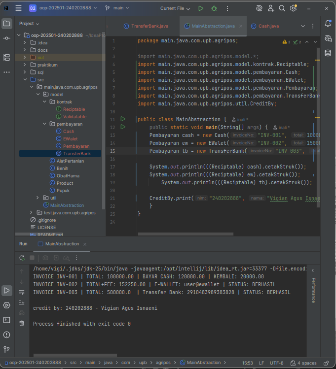

# Laporan Praktikum Minggu 1 (sesuaikan minggu ke berapa?)
Topik: Bab 5 – Abstraction (Abstract Class & Interface)

## Identitas
- Nama  : Vigian Agus Isnaeni
- NIM   : 240202888
- Kelas : 3IKRB

---

## Tujuan
- Mahasiswa mampu **menjelaskan perbedaan abstract class dan interface**.
- Mahasiswa mampu **mendesain abstract class dengan method abstrak** sesuai kebutuhan kasus.
- Mahasiswa mampu **membuat interface dan mengimplementasikannya pada class**.
- Mahasiswa mampu **menerapkan multiple inheritance melalui interface** pada rancangan kelas.
- Mahasiswa mampu **mendokumentasikan kode** (komentar kelas/method, README singkat pada folder minggu).

---

## Dasar Teori
**Abstraksi** adalah proses menyederhanakan kompleksitas dengan menampilkan elemen penting dan menyembunyikan detail implementasi.
- **Abstract class**: tidak dapat diinstansiasi, dapat memiliki method abstrak (tanpa badan) dan non-abstrak. Dapat menyimpan state (field).
- **Interface**: kumpulan kontrak (method tanpa implementasi konkret). Sejak Java 8 mendukung default method. Mendukung **multiple inheritance** (class dapat mengimplementasikan banyak interface).
- Gunakan **abstract class** bila ada _shared state_ dan perilaku dasar; gunakan **interface** untuk mendefinisikan kemampuan/kontrak lintas hierarki.

Dalam konteks Agri-POS, **Pembayaran** dapat dimodelkan sebagai abstract class dengan method abstrak `prosesPembayaran()` dan `biaya()`. Implementasi konkritnya: `Cash` dan `EWallet`. Kemudian, interface seperti `Validatable` (mis. verifikasi OTP) dan `Receiptable` (mencetak bukti) dapat diimplementasikan oleh jenis pembayaran yang relevan.

---

## Langkah Praktikum
1. **Abstract Class – Pembayaran**
    - Buat `Pembayaran` (abstract) dengan field `invoiceNo`, `total` dan method:
        - `double biaya()` (abstrak) → biaya tambahan (fee).
        - `boolean prosesPembayaran()` (abstrak) → mengembalikan status berhasil/gagal.
        - `double totalBayar()` (konkrit) → `return total + biaya();`.

2. **Subclass Konkret**
    - `Cash` → biaya = 0, proses = selalu berhasil jika `tunai >= totalBayar()`.
    - `EWallet` → biaya = 1.5% dari `total`; proses = membutuhkan validasi.

3. **Interface**
    - `Validatable` → `boolean validasi();` (contoh: OTP).
    - `Receiptable` → `String cetakStruk();`

4. **Multiple Inheritance via Interface**
    - `EWallet` mengimplementasikan **dua interface**: `Validatable`, `Receiptable`.
    - `Cash` setidaknya mengimplementasikan `Receiptable`.

5. **Main Class**
    - Buat `MainAbstraction.java` untuk mendemonstrasikan pemakaian `Pembayaran` (polimorfik).
    - Tampilkan hasil proses dan struk. Di akhir, panggil `CreditBy.print("[NIM]", "[Nama]")`.

6. **Commit dan Push**
    - Commit dengan pesan: `week5-abstraction-interface`.

---

## Kode Program
 
Pembayaran.java
```java
public abstract class Pembayaran {

    protected String invoiceNo;
    protected double total;

    public Pembayaran(String invoiceNo, double total) {
        this.invoiceNo = invoiceNo;
        this.total = total;
    }

    public Pembayaran() {
    }

    public abstract double biaya();               // fee/biaya tambahan
    public abstract boolean prosesPembayaran();   // proses spesifik tiap metode

    public double totalBayar() {
        return total + biaya();
    }

    public String getInvoiceNo() { return invoiceNo; }
    public double getTotal() { return total; }

}
```

Cash.java
```java
public class Cash extends Pembayaran implements Reciptable {
    private double tunai;

    public Cash(String invoiceNo, double total, double tunai) {
        super(invoiceNo, total);
        this.tunai = tunai;
    }

    @Override
    public double biaya() {
        return 0.0;
    }

    @Override
    public boolean prosesPembayaran() {
        return tunai >= totalBayar(); // sederhana: cukup uang tunai
    }

    @Override
    public String cetakStruk() {
        return String.format("INVOICE %s | TOTAL: %.2f | BAYAR CASH: %.2f | KEMBALI: %.2f",
                invoiceNo, totalBayar(), tunai, Math.max(0, tunai - totalBayar()));
    }
}
```

EWalet.java
```java
public class EWalet extends Pembayaran implements Validatable,Reciptable {

    private String akun;
    private String otp; // sederhana untuk simulasi

    public EWalet(String invoiceNo, double total, String akun, String otp) {
        super(invoiceNo,total);
        this.akun = akun;
        this.otp = otp;
    }

    @Override
    public double biaya() {
        return total * 0.015; // 1.5% fee
    }

    @Override
    public boolean validasi() {
        return otp != null && otp.length() == 6; // contoh validasi sederhana
    }

    @Override
    public boolean prosesPembayaran() {
        return validasi(); // jika validasi lolos, anggap berhasil
    }

    @Override
    public String cetakStruk() {
        return String.format("INVOICE %s | TOTAL+FEE: %.2f | E-WALLET: %s | STATUS: %s",
                invoiceNo, totalBayar(), akun, prosesPembayaran() ? "BERHASIL" : "GAGAL");
    }
}
```

TransferBank.java
```java
public class TransferBank extends Pembayaran implements Reciptable, Validatable {
    String noRek;
    boolean pin;

    public TransferBank(String invoiceNo, double total, String noRek, boolean pin) {
        super(invoiceNo, total);
        this.noRek = noRek;
        this.pin = pin;
    }

    @Override
    public String cetakStruk() {
        return String.format("INVOICE %s | TOTAL: %s  | Transfer Bank: %s | STATUS: %s",
                invoiceNo, totalBayar(), noRek, prosesPembayaran() ? "BERHASIL" : "GAGAL");
    }

    @Override
    public boolean validasi() {
        return total >= 3500 && pin == true && noRek.length()==16 ;
    }

    @Override
    public double biaya() {
        return 0;
    }

    @Override
    public boolean prosesPembayaran() {
        return validasi();
    }
}
```

---

## Hasil Eksekusi
(Sertakan screenshot hasil eksekusi program.  

)
---

## Analisis
1. Jelaskan bagaimana kode berjalan.
   Kode ini secara efektif mengimplementasikan Abstraksi dengan Abstract Class (Pembayaran) sebagai kerangka dasar untuk semua jenis pembayaran. Ia mendefinisikan state bersama dan memaksa subclass untuk mengimplementasikan perilaku unik melalui method abstrak.

2. Apa perbedaan pendekatan minggu ini dibanding minggu sebelumnya.  
   Pendekatan ini berfokus pada kontrak dan kemampuan (Interface), berbeda dengan minggu sebelumnya yang mungkin fokus pada implementasi konkret melalui pewarisan sederhana. Hasilnya adalah kode yang lebih fleksibel dan loosely coupled, ideal untuk memperluas sistem pembayaran di masa depan.
3. Kendala yang dihadapi dan cara mengatasinya.
    ...

---

## Kesimpulan
 Praktikum berhasil mengimplementasikan Abstraksi dan Polimorfisme melalui abstract class dan interface, yang menghasilkan rancangan kode yang terstruktur dan mudah dikembangkan. Penggunaan interface secara khusus memungkinkan Multiple Inheritance yang aman, menambah kemampuan spesifik pada objek tanpa mengacaukan hierarki kelas inti.

---

## Quiz
1. Jelaskan perbedaan konsep dan penggunaan **abstract class** dan **interface**.  
   **Jawaban:** Abstract class mendefinisikan hubungan IS-A yang kuat dalam hierarki kelas, menyimpan state bersama, dan dapat memiliki method konkret dan abstrak. Interface mendefinisikan kontrak CAN-DO (kemampuan), tidak menyimpan state non-konstan, dan memungkinkan sebuah kelas mengimplementasikan banyak kontrak.

2. Mengapa **multiple inheritance** lebih aman dilakukan dengan interface pada Java?  
   **Jawaban:** Multiple inheritance dengan interface aman karena interface pada dasarnya hanya mendefinisikan signature method (kontrak), sehingga tidak ada konflik state yang diwariskan. Jika terjadi benturan default method, Java memaksa kelas pengimplementasi untuk menyediakan implementasi spesifiknya sendiri, menyelesaikan ambiguitas secara eksplisit.

3. Pada contoh Agri-POS, bagian mana yang **paling tepat** menjadi abstract class dan mana yang menjadi interface? Jelaskan alasannya.  
   **Jawaban:** Pembayaran paling tepat menjadi Abstract Class karena merupakan konsep inti dengan shared state (total) dan hubungan IS-A yang kuat dengan jenis pembayarannya. Validatable dan Receiptable paling tepat menjadi Interface karena keduanya adalah kemampuan tambahan yang dapat ditambahkan secara fleksibel pada kelas mana pun di luar hierarki pembayaran utama.


