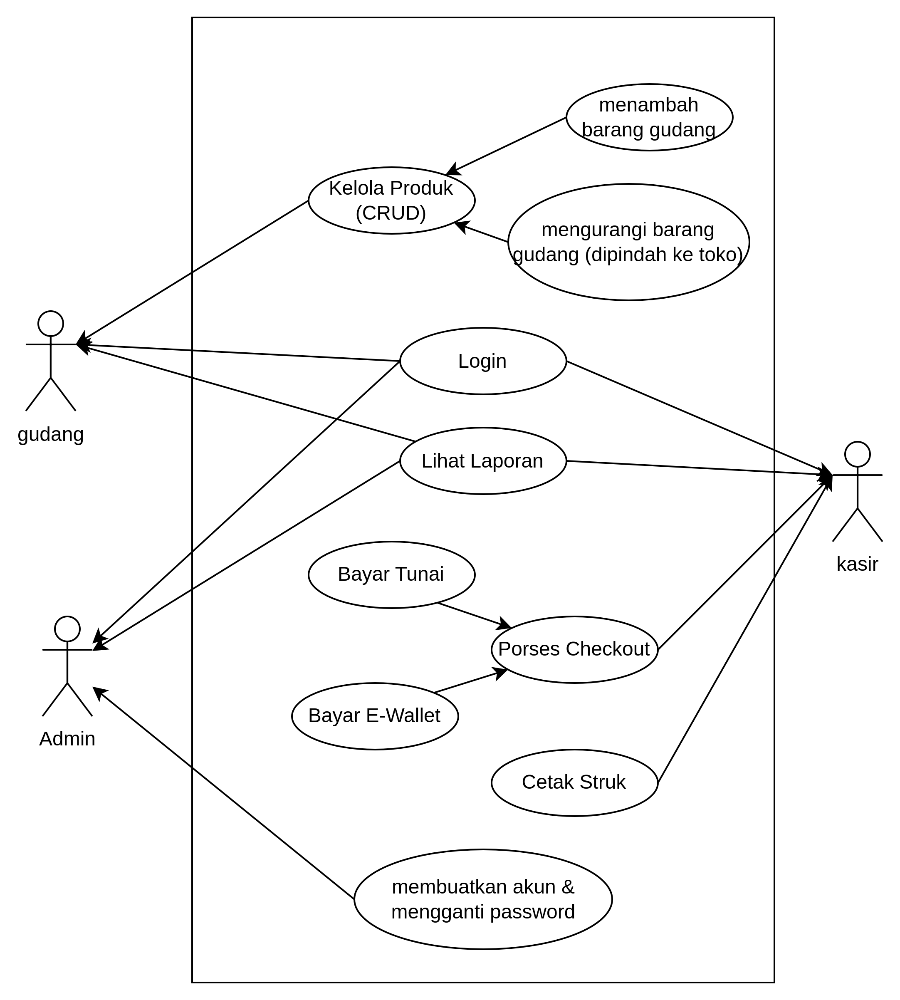
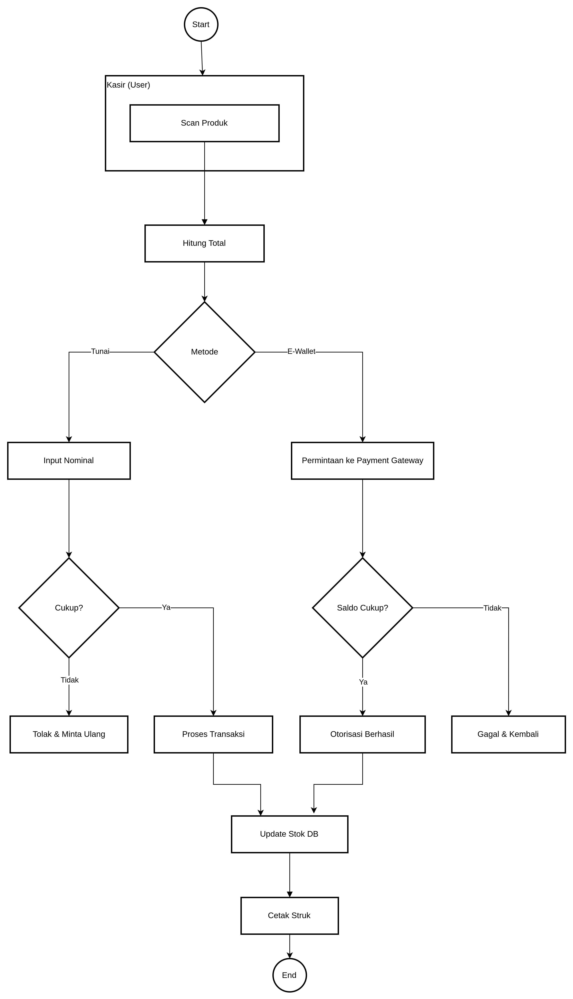
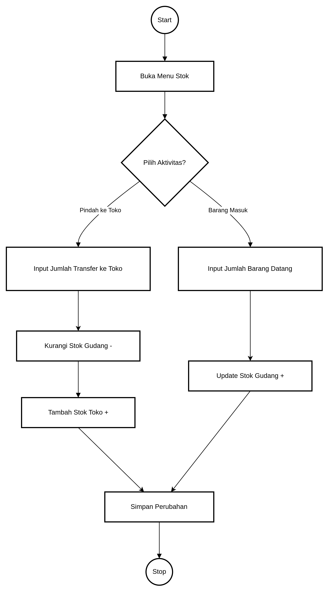
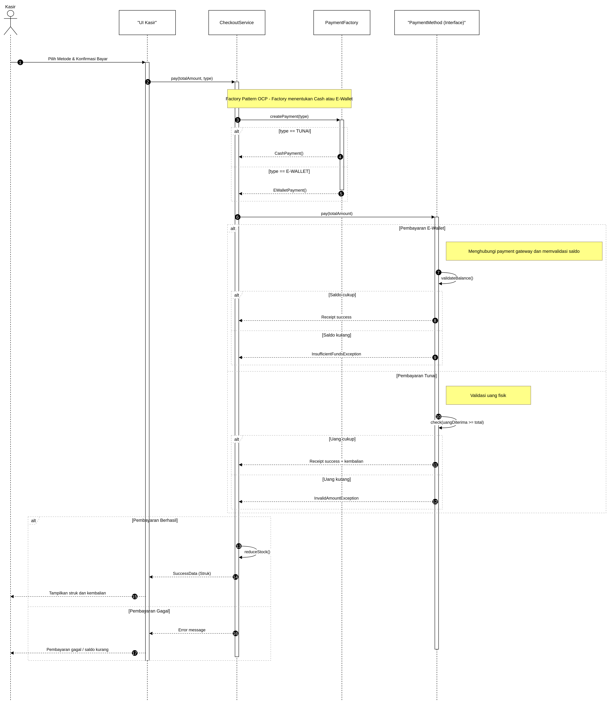

# Laporan Praktikum Minggu 6

Topik: Desain Arsitektur Sistem Agri-POS menggunakan UML dan Prinsip SOLID

## Identitas

* Nama  : Vigian Agus Isnaeni
* NIM   : 240202888
* Kelas : 3IKRB

---

## Tujuan

* Mahasiswa memahami **desain arsitektur sistem menggunakan UML**.
* Mahasiswa memahami **penerapan prinsip SOLID dalam desain perangkat lunak**.
* Mahasiswa mampu **menganalisis hubungan antara kebutuhan fungsional dan desain UML**.
* Mahasiswa mampu **mengembangkan argumentasi desain berdasarkan prinsip OOP & SOLID**.

---

## Deskripsi Sistem Agri-POS

Agri-POS adalah sistem Point of Sale untuk penjualan produk pertanian (benih, pupuk, alat). Terdapat dua peran utama:

* **Admin** → Mengelola produk dan laporan.
* **Kasir** → Melakukan transaksi checkout dan pembayaran.
* **admin** → Melakukan  pengawasan dan membuatkan akun.

Kebutuhan Fungsional (FR) yang dicakup:

* Manajemen Produk (CRUD)
* Transaksi Penjualan (Checkout)
* Pembayaran Tunai & E-Wallet
* Pencetakan Struk
* Login & Hak Akses

---

## 1. Desain Arsitektur UML

Empat diagram UML disusun untuk menggambarkan struktur dan perilaku sistem.

### 1.1 Use Case Diagram

* Menjelaskan fungsi sistem dari sudut pandang aktor.
* Generalization digunakan pada metode pembayaran:

  * **Bayar Tunai** dan **Bayar E-Wallet** adalah bentuk khusus dari **Proses Checkout**.
* Include digunakan antara **Checkout** dan **Cetak Struk**.

**Aktor & Use Case:**

Admin : login, membuat akun, Lihat Laporan  
Kasir : Login, Proses Checkout, Cetak Struk 
gudang : login, kelola produk gudang

### 1.2 Activity Diagram – Proses Checkout

* Menggambarkan alur kerja pembayaran.
* Swimlanes: **Kasir**, **Sistem**, **Payment Gateway**.
* Terdapat Decision Node untuk:

  * Validasi stok
  * Validasi saldo/uang

### 1.3 Activity Diagram – Proses kelola gudang

* Menggambarkan alur kerja penambahan dan pengurangan barang yang ada di gudang.

### 1.4 Sequence Diagram – Proses Pembayaran

Menjelaskan interaksi antar objek:

* CheckoutService meminta objek PaymentMethod dari PaymentFactory (OCP).
* CheckoutService memanggil `pay()` pada interface PaymentMethod (LSP & DIP).
* Blok **alt** untuk membedakan pembayaran Tunai vs E-Wallet.

### 1.5 Class Diagram

* Struktur statis sistem.
* Menggunakan interface dan dependency injection.
* Kelas utama:

  * CheckoutService
  * ProductService
  * PaymentMethod (Interface)
  * CashPayment, EWalletPayment (Implementasi)
  * PaymentFactory

---

## 2. Penerapan Prinsip SOLID

Desain Agri-POS menerapkan empat prinsip SOLID secara eksplisit.

   - S - Single Responsibility Principle (SRP) Prinsip ini menyatakan bahwa satu kelas hanya boleh memiliki satu alasan untuk berubah atau satu tanggung jawab utama. Dalam sistem ini, tanggung jawab dipisahkan secara jelas di mana CheckoutService hanya fokus mengatur logika transaksi, sedangkan ProductRepository khusus menangani akses dan manipulasi data ke database.

   - O - Open/Closed Principle (OCP) Entitas perangkat lunak harus terbuka untuk ekstensi (perluasan) tetapi tertutup untuk modifikasi. Penerapannya terlihat saat ingin menambah metode pembayaran baru (misalnya QRIS), pengembang cukup membuat kelas baru QrisPayment tanpa perlu mengubah atau membongkar kode lama di CheckoutService.

   - L - Liskov Substitution Principle (LSP) Objek dari kelas turunan harus dapat menggantikan objek dari kelas induknya tanpa mengubah kebenaran program. Pada desain ini, CashPayment dan EWalletPayment merupakan turunan yang valid dan dapat digunakan kapan saja untuk menggantikan interface induknya, yaitu PaymentMethod, tanpa menyebabkan error.

   - I - Interface Segregation Principle (ISP) Klien tidak boleh dipaksa untuk bergantung pada interface yang tidak mereka gunakan. Sistem menerapkan ini dengan membuat interface yang spesifik, yaitu PaymentMethod yang hanya berisi fungsi pembayaran dan ProductRepository yang hanya berisi fungsi pengelolaan data produk, sehingga tidak ada fungsi yang mubazir.

   -D - Dependency Inversion Principle (DIP) Modul tingkat tinggi tidak boleh bergantung pada modul tingkat rendah, keduanya harus bergantung pada abstraksi. Hal ini diwujudkan dengan CheckoutService (tingkat tinggi) yang tidak bergantung langsung pada implementasi database konkret, melainkan bergantung pada interface ProductRepository (abstraksi).
---

## 3. Traceability Matrix (FR → Desain)

   - Manajemen Produk Fungsionalitas ini dipetakan pada Use Case "Kelola Produk" dan direalisasikan secara teknis oleh kolaborasi kelas ProductService, ProductRepository, dan entitas Product.

   - Transaksi / Checkout Proses transaksi utama didefinisikan dalam Use Case "Proses Checkout" dengan alur kerja yang digambarkan pada Activity Diagram Checkout, serta diimplementasikan oleh kelas CheckoutService yang berinteraksi dengan ProductService.

   - Pembayaran Fitur pembayaran (Tunai & E-Wallet) didetailkan interaksinya melalui Sequence Diagram Pembayaran dan direalisasikan menggunakan pola desain yang melibatkan PaymentFactory, interface PaymentMethod, serta kelas turunan CashPayment dan EWalletPayment.

   - Cetak Struk Kebutuhan untuk mencetak bukti transaksi terintegrasi dalam alur Activity/Sequence Diagram Pembayaran dan diwujudkan dalam kode program melalui objek Receipt sebagai representasi struk belanja.

   - Login / Akses Keamanan akses sistem dipetakan pada Use Case "Login", di mana proses autentikasi pengguna ditangani oleh layanan AuthService terhadap data entitas User.

---

## 4. Quiz & Argumentasi Desain

### 1. Perbedaan Aggregation dan Composition + Contoh

* **Aggregation:** Hubungan lemah (part tetap hidup tanpa whole).
  Contoh: Store → Cashier (kasir tetap ada meski store dihapus).

* **Composition:** Hubungan kuat (part hilang jika whole hilang).
  Contoh: Transaction → TransactionDetail (detail hilang jika transaksi dihapus).

### 2. Bagaimana OCP membuat sistem mudah dikembangkan?

* Entitas dapat ditambah tanpa memodifikasi kode lama.
* Contoh: Menambah metode **QRIS** hanya dengan menambahkan class baru yang mengimplementasikan PaymentMethod.
* Tidak mengubah CheckoutService → risiko bug berkurang.

### 3. Mengapa DIP meningkatkan testability?

* High-level bergantung pada abstraksi, bukan detail.
* Contoh: CheckoutService dapat diuji menggunakan **MockProductRepository**, tanpa DB nyata.
* Unit test lebih cepat, terisolasi, dan andal.

---

## Kesimpulan

Desain arsitektur Agri-POS menggunakan UML dan prinsip SOLID:

* Memenuhi kebutuhan fungsional
* Memiliki maintainability tinggi
* Mudah diperluas (extensible)
* Meminimalkan ketergantungan langsung (loose coupling)

Penggunaan Factory Pattern, Repository Pattern, dan Interface memastikan fleksibilitas tinggi. Sistem juga siap dikembangkan dengan pola tambahan seperti Strategy (Diskon) dan Observer (Notifikasi Stok).

---