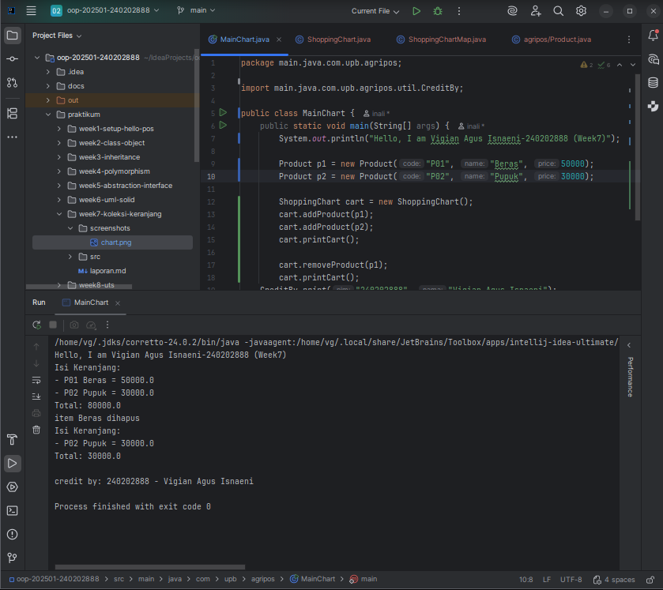
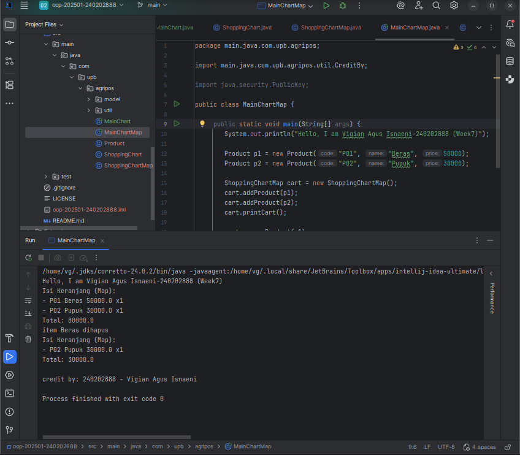

# Laporan Praktikum Minggu 7

Topik: Collections dan Implementasi Keranjang Belanja

## Identitas

* Nama  : Vigian AGus Isnaeni
* NIM   : 240202888
* Kelas : 3IKRB

---

## Tujuan

1. Menjelaskan konsep collection dalam Java (List, Map, Set).
2. Menggunakan ArrayList untuk menyimpan dan mengelola objek.
3. Mengimplementasikan Map atau Set sesuai kebutuhan pengelolaan data.
4. Melakukan operasi dasar pada collection: tambah, hapus, dan hitung total.
5. Menganalisis efisiensi penggunaan collection dalam konteks sistem Agri-POS.

---

## Dasar Teori

### 1. Collections Framework

Java Collections Framework menyediakan struktur data untuk mengelola objek secara dinamis dan efisien.

Struktur utama:

- List (implementasi: ArrayList) — Terurut, dapat menyimpan elemen duplikat.
- Map (implementasi: HashMap) — Menyimpan pasangan key–value, akses cepat berdasarkan key.
- Set (implementasi: HashSet) — Tidak menerima duplikat dan tidak mempertahankan urutan.

---

### 2. Studi Kasus: Keranjang Belanja Agri-POS

Keranjang belanja harus dapat:

- Menambahkan produk
- Menghapus produk
- Menampilkan isi keranjang
- Menghitung total nilai transaksi
- Menangani jumlah (quantity) menggunakan Map

Kasus ini mencerminkan penggunaan struktur data dalam aplikasi nyata seperti POS.

---

## Langkah Praktikum

### 1. Membuat Class Product

```java
package com.upb.agripos;

public class Product {
    private final String code;
    private final String name;
    private final double price;

    public Product(String code, String name, double price) {
        this.code = code;
        this.name = name;
        this.price = price;
    }

    public String getCode() { return code; }
    public String getName() { return name; }
    public double getPrice() { return price; }
}
```

## 2. Implementasi Keranjang dengan ArrayList

```java
package com.upb.agripos;

import java.util.ArrayList;

public class ShoppingCart {
    private final ArrayList<Product> items = new ArrayList<>();

    public void addProduct(Product p) { items.add(p); }
    public void removeProduct(Product p) { items.remove(p); }

    public double getTotal() {
        double sum = 0;
        for (Product p : items) {
            sum += p.getPrice();
        }
        return sum;
    }

    public void printCart() {
        System.out.println("Isi Keranjang:");
        for (Product p : items) {
            System.out.println("- " + p.getCode() + " " + p.getName() + " = " + p.getPrice());
        }
        System.out.println("Total: " + getTotal());
    }
}
```

## 3. Main Program (WAJIB DIISI)

```java
package com.upb.agripos;

public class MainCart {
    public static void main(String[] args) {
        System.out.println("Hello, I am [Nama]-[NIM] (Week7)");

        Product p1 = new Product("P01", "Beras", 50000);
        Product p2 = new Product("P02", "Pupuk", 30000);

        ShoppingCart cart = new ShoppingCart();
        cart.addProduct(p1);
        cart.addProduct(p2);
        cart.printCart();

        cart.removeProduct(p1);
        cart.printCart();
    }
}
```

## 4. Implementasi Alternatif Menggunakan Map (Dengan Quantity)

```java
package com.upb.agripos;

import java.util.HashMap;
import java.util.Map;

public class ShoppingCartMap {
    private final Map<Product, Integer> items = new HashMap<>();

    public void addProduct(Product p) { items.put(p, items.getOrDefault(p, 0) + 1); }

    public void removeProduct(Product p) {
        if (!items.containsKey(p)) return;
        int qty = items.get(p);
        if (qty > 1) items.put(p, qty - 1);
        else items.remove(p);
    }

    public double getTotal() {
        double total = 0;
        for (Map.Entry<Product, Integer> entry : items.entrySet()) {
            total += entry.getKey().getPrice() * entry.getValue();
        }
        return total;
    }

    public void printCart() {
        System.out.println("Isi Keranjang (Map):");
        for (Map.Entry<Product, Integer> e : items.entrySet()) {
            System.out.println("- " + e.getKey().getCode() + " " + e.getKey().getName() + " x" + e.getValue());
        }
        System.out.println("Total: " + getTotal());
    }
}
```

---

## Kode Program

### Menggunakan ArrayList
```java
public class MainChart {
    public static void main(String[] args) {
        System.out.println("Hello, I am Vigian Agus Isnaeni-240202888 (Week7)");

        Product p1 = new Product("P01", "Beras", 50000);
        Product p2 = new Product("P02", "Pupuk", 30000);

        ShoppingChart cart = new ShoppingChart();
        cart.addProduct(p1);
        cart.addProduct(p2);
        cart.printCart();

        cart.removeProduct(p1);
        cart.printCart();
        CreditBy.print("240202888", "Vigian Agus Isnaeni");
    }
}
printCart();
}
```

### Menggunakan Map
```java
public class MainChartMap {
    public static void main(String[] args) {
        System.out.println("Hello, I am Vigian Agus Isnaeni-240202888 (Week7)");

        Product p1 = new Product("P01", "Beras", 50000);
        Product p2 = new Product("P02", "Pupuk", 30000);

        ShoppingChartMap cart = new ShoppingChartMap();
        cart.addProduct(p1);
        cart.addProduct(p2);
        cart.printCart();

        cart.removeProduct(p1);
        cart.printCart();
        CreditBy.print("240202888", "Vigian Agus Isnaeni");
    }
}
```

---

## Hasil Eksekusi

### Menggunakan ArrayList


### Menggunakan Map


---

## Analisis

Pada praktikum minggu ke-7, konsep Collections dimanfaatkan untuk mengembangkan fitur keranjang belanja pada aplikasi Agri-POS.

* **Alur Kerja Program**
Sistem menggunakan ArrayList sebagai wadah penyimpanan objek Product. Produk dapat ditambahkan maupun dihapus dari keranjang, sementara total harga diperoleh dengan menelusuri seluruh elemen di dalam collection. Sebagai alternatif, penggunaan HashMap memungkinkan penyimpanan data produk beserta jumlahnya (quantity), sehingga lebih efisien dan mendekati kebutuhan sistem POS yang sesungguhnya.

* **Perbandingan Penggunaan List dan Map**
ArrayList sesuai untuk implementasi keranjang belanja yang sederhana, tetapi menjadi kurang efektif ketika produk yang sama dimasukkan berulang kali. Sebaliknya, Map menawarkan solusi yang lebih optimal karena setiap produk hanya disimpan satu kali dengan jumlah yang dapat diatur.

* **Permasalahan dan Penyelesaian**
Permasalahan utama yang muncul adalah adanya data produk duplikat pada ArrayList. Untuk mengatasi hal tersebut, digunakan struktur data Map agar pengelolaan quantity produk dapat dilakukan dengan lebih terstruktur dan efisien.
---

## Kesimpulan

Penggunaan Java Collections Framework memberikan kemudahan dalam pengelolaan data yang bersifat dinamis. Melalui pemanfaatan ArrayList dan HashMap, fitur keranjang belanja pada sistem Agri-POS dapat diimplementasikan secara lebih efisien, terorganisir, serta mudah untuk dikembangkan di kemudian hari.

---

## Quiz

1. Jelaskan perbedaan antara **List**, **Map**, dan **Set**.
   **Jawaban:** List merupakan struktur data yang menyimpan elemen secara berurutan, memperbolehkan data duplikat, dan diakses menggunakan indeks. Set adalah struktur data yang hanya menyimpan elemen unik tanpa mengizinkan duplikasi, serta umumnya tidak menjamin urutan penyimpanan. Sementara itu, Map digunakan untuk menyimpan data dalam bentuk pasangan key–value, di mana setiap key harus unik, sedangkan value dapat bernilai sama.

2. Mengapa **ArrayList** cocok untuk keranjang belanja sederhana?
   **Jawaban:** ArrayList cocok digunakan untuk keranjang belanja sederhana karena mudah diimplementasikan, mendukung penyimpanan data secara berurutan, serta memungkinkan penambahan dan penghapusan item dengan cepat. Selain itu, ArrayList memperbolehkan data duplikat sehingga sesuai untuk keranjang belanja dasar tanpa pengelolaan jumlah (quantity) produk yang kompleks.

3. Bagaimana **Set** mencegah duplikasi data?
   **Jawaban:** Set mencegah duplikasi data dengan memastikan setiap elemen yang disimpan bersifat unik. Saat sebuah elemen ditambahkan, Set akan membandingkannya dengan elemen yang sudah ada menggunakan metode equals() dan hashCode(). Jika elemen tersebut sudah terdapat di dalam Set, maka elemen baru tidak akan ditambahkan, sehingga duplikasi data dapat dihindari.

4. Kapan sebaiknya menggunakan **Map** dibandingkan List? Berikan contoh.
   **Jawaban:** Map sebaiknya digunakan ketika data memiliki hubungan key–value dan membutuhkan akses cepat berdasarkan suatu kunci, bukan berdasarkan urutan. Selain itu, Map lebih tepat digunakan saat setiap data harus bersifat unik pada bagian key dan memiliki atribut tambahan seperti jumlah atau status. 
   - Contoh:
   Dalam sistem keranjang belanja, Map digunakan untuk menyimpan produk sebagai key dan jumlah (quantity) sebagai value. Dengan cara ini, satu produk hanya disimpan satu kali, sementara jumlahnya dapat diperbarui tanpa menimbulkan data duplikat, sehingga lebih efisien dibandingkan menggunakan List.