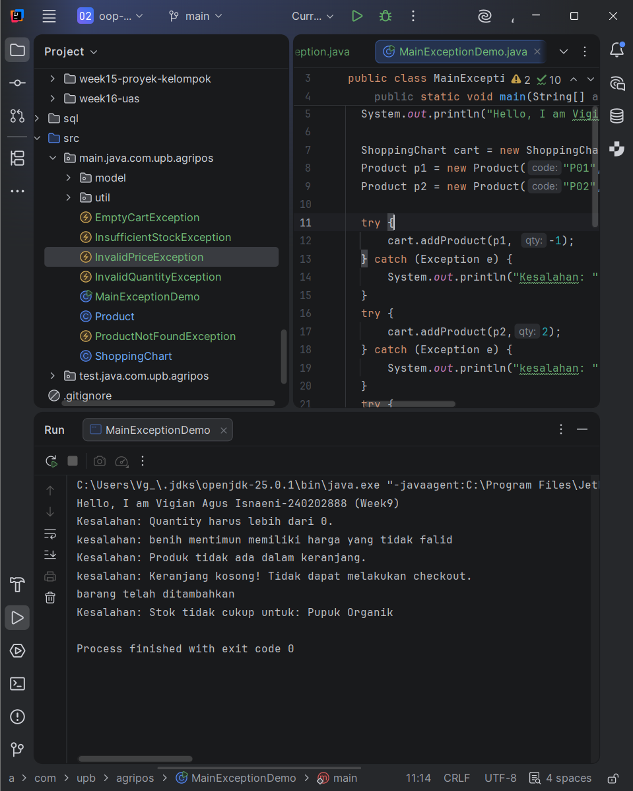

# Laporan Praktikum Minggu 1 (sesuaikan minggu ke berapa?)
Topik: Exception Handling, Custom Exception, dan Penerapan Design Pattern

## Identitas
- Nama  : Vigian Agus Isnaeni
- NIM   : 240202888
- Kelas : 3IKRB

---

## Tujuan
Mahasiswa mampu:
1. Menjelaskan perbedaan antara error dan exception.
2. Mengimplementasikan try–catch–finally dengan tepat.
3. Membuat custom exception sesuai kebutuhan program.
4. Mengintegrasikan exception handling ke dalam aplikasi sederhana (kasus keranjang belanja).
5. (Opsional) Menerapkan design pattern sederhana (Singleton/MVC) dan unit testing dasar.

---

## Dasar Teori

### 1. Error vs Exception

- Error → kondisi fatal, tidak dapat ditangani (contoh: OutOfMemoryError).
- Exception → kondisi tidak normal yang dapat ditangani oleh program.

### 2. Struktur try–catch–finally

```java
try {
    // kode yang berpotensi menimbulkan kesalahan
} catch (Exception e) {
    // penanganan
} finally {
    // blok yang selalu dijalankan
}
```

### 3. Membuat Custom Exception

```java
package com.upb.agripos;

public class InvalidQuantityException extends Exception {
    public InvalidQuantityException(String message) {
        super(message);
    }
}
```

---

## Langkah Praktikum

### 1. Membuat Custom Exception

```java
package com.upb.agripos;

public class InvalidQuantityException extends Exception {
    public InvalidQuantityException(String msg) { super(msg); }
}
```

```java
package com.upb.agripos;

public class ProductNotFoundException extends Exception {
    public ProductNotFoundException(String msg) { super(msg); }
}
```

```java
package com.upb.agripos;

public class InsufficientStockException extends Exception {
    public InsufficientStockException(String msg) { super(msg); }
}
```

### 2. Model Product dengan Stok

```java
package com.upb.agripos;

public class Product {
    private final String code;
    private final String name;
    private final double price;
    private int stock;

    public Product(String code, String name, double price, int stock) {
        this.code = code;
        this.name = name;
        this.price = price;
        this.stock = stock;
    }

    public String getCode() { return code; }
    public String getName() { return name; }
    public double getPrice() { return price; }
    public int getStock() { return stock; }
    public void reduceStock(int qty) { this.stock -= qty; }
}
```

### 3. Implementasi ShoppingCart dengan Exception Handling

```java
package com.upb.agripos;

import java.util.HashMap;
import java.util.Map;

public class ShoppingCart {
    private final Map<Product, Integer> items = new HashMap<>();

    public void addProduct(Product p, int qty) throws InvalidQuantityException {
        if (qty <= 0) {
            throw new InvalidQuantityException("Quantity harus lebih dari 0.");
        }
        items.put(p, items.getOrDefault(p, 0) + qty);
    }

    public void removeProduct(Product p) throws ProductNotFoundException {
        if (!items.containsKey(p)) {
            throw new ProductNotFoundException("Produk tidak ada dalam keranjang.");
        }
        items.remove(p);
    }

    public void checkout() throws InsufficientStockException {
        for (Map.Entry<Product, Integer> entry : items.entrySet()) {
            Product product = entry.getKey();
            int qty = entry.getValue();
            if (product.getStock() < qty) {
                throw new InsufficientStockException(
                    "Stok tidak cukup untuk: " + product.getName()
                );
            }
        }
        // contoh pengurangan stok bila semua cukup
        for (Map.Entry<Product, Integer> entry : items.entrySet()) {
            entry.getKey().reduceStock(entry.getValue());
        }
    }
}
```

### 4. Main Program untuk Menguji Exception Handling

```java
package com.upb.agripos;

public class MainExceptionDemo {
    public static void main(String[] args) {
        System.out.println("Hello, I am [Nama]-[NIM] (Week9)");

        ShoppingCart cart = new ShoppingCart();
        Product p1 = new Product("P01", "Pupuk Organik", 25000, 3);

        try {
            cart.addProduct(p1, -1);
        } catch (InvalidQuantityException e) {
            System.out.println("Kesalahan: " + e.getMessage());
        }

        try {
            cart.removeProduct(p1);
        } catch (ProductNotFoundException e) {
            System.out.println("Kesalahan: " + e.getMessage());
        }

        try {
            cart.addProduct(p1, 5);
            cart.checkout();
        } catch (Exception e) {
            System.out.println("Kesalahan: " + e.getMessage());
        }
    }
}
```

---

## Kode Program
MainExceptionDemo.java
```java
class MainExceptionDemo {
   public static void main(String[] args) throws InvalidQuantityException {
      System.out.println("Hello, I am Vigian Agus Isnaeni-240202888 (Week9)");

      ShoppingChart cart = new ShoppingChart();
      Product p1 = new Product("P01", "Pupuk Organik", 25000, 11);
      Product p2 = new Product("P02", "benih mentimun", -1000,20);

      try {
         cart.addProduct(p1, -1);
      } catch (Exception e) {
         System.out.println("Kesalahan: " + e.getMessage());
      }
      try {
         cart.addProduct(p2,2);
      } catch (Exception e) {
         System.out.println("kesalahan: "+ e.getMessage());
      }
      try {
         cart.removeProduct(p1);
      } catch (ProductNotFoundException e) {
         System.out.println("Kesalahan: " + e.getMessage());
      }

      try {
         cart.checkout();
      } catch (Exception e) {
         System.out.println("kesalahan: "+ e.getMessage());
      }


      try {
         cart.addProduct(p1, 20);
         cart.checkout();
      } catch (Exception e) {
         System.out.println("Kesalahan: " + e.getMessage());
      }
   }
}

```
ShoppingChart.java
```java
public class ShoppingChart {
    private final Map<Product, Integer> items = new HashMap<>();

    public void addProduct(Product p, int qty) throws InvalidQuantityException, InvalidPriceException{
        if (qty <= 0) {
            throw new InvalidQuantityException("Quantity harus lebih dari 0.");
        }
        if (p.getPrice()<=0){
            throw new InvalidPriceException(p.getName()+ " memiliki harga yang tidak falid");
        }
        items.put(p, items.getOrDefault(p, 0) + qty);
        System.out.println( "barang telah ditambahkan");
    }

    public void removeProduct(Product p) throws ProductNotFoundException {
        if (!items.containsKey(p)) {
            throw new ProductNotFoundException("Produk tidak ada dalam keranjang.");
        }
        items.remove(p);
        System.out.println("barang telah dihapus");
    }

    public void checkout() throws InsufficientStockException, EmptyCartException {
        if (items.isEmpty()) {
            throw new EmptyCartException("Keranjang kosong! Tidak dapat melakukan checkout.");
        }

        for (Map.Entry<Product, Integer> entry : items.entrySet()) {
            Product product = entry.getKey();
            int qty = entry.getValue();
            if (product.getStock() < qty) {
                throw new InsufficientStockException(
                        "Stok tidak cukup untuk: " + product.getName()
                );
            }
        }

        System.out.println("\n Isi Keranjang:");
        for (Map.Entry<Product, Integer> e : items.entrySet()) {
            System.out.println("- " + e.getKey().getCode() + " " + e.getKey().getName() + " x" + e.getValue());
        }
        System.out.println("isi keranjang selesai dicheckout");
        // contoh pengurangan stok bila semua cukup
        for (Map.Entry<Product, Integer> entry : items.entrySet()) {
            entry.getKey().reduceStock(entry.getValue());
        }
    }
}
```

---

## Hasil Eksekusi



---

## Analisis

Program membuat keranjang belanja dan 2 produk (Pupuk Organik stok 11, Benih Mentimun harga -1000). Kemudian melakukan 5 percobaan:

1. Tambah produk dengan quantity -1 → error ditangkap (InvalidQuantityException)
2. Tambah produk dengan harga negatif → error ditangkap (InvalidPriceException)
3. Hapus produk yang belum ada di keranjang → error ditangkap (ProductNotFoundException)
4. Checkout keranjang kosong → error ditangkap (EmptyCartException)
5. Tambah produk quantity 20 tapi stok cuma 11 → error ditangkap (InsufficientStockException)

Try-catch memastikan program tetap jalan meskipun ada error, dan menampilkan pesan yang jelas.

---

## Kesimpulan

Exception handling dan custom exception membuat program POS lebih aman dan tidak gampang berhenti ataupun crash. Custom exception (seperti InvalidQuantityException, InvalidPriceException, ProductNotFoundException, dll) membantu menangani kesalahan tertentu dengan pesan yang mudah dimengerti. Try-catch membuat program tetap berjalan walau ada error dan memberi tahu user apa yang salah. Dengan cara ini, program jadi lebih berkualitas, mudah diperbaiki, dan mudah dikembangkan.

---

## Quiz
1. Jelaskan perbedaan error dan exception.
   **Jawaban:** Error adalah masalah fatal yang tidak bisa ditangani program (contoh: OutOfMemoryError). Exception adalah masalah yang bisa ditangani dengan try-catch dan program masih bisa berjalan.

2. Apa fungsi finally dalam blok try–catch–finally?
   **Jawaban:** Blok yang selalu dijalankan, baik ada exception atau tidak. Biasa dipakai untuk tutup koneksi database atau file.

3. Mengapa custom exception diperlukan? 
   **Jawaban:** Untuk membuat exception spesifik sesuai kebutuhan bisnis aplikasi, dengan pesan error yang lebih jelas dan mudah dipahami.

4. Berikan contoh kasus bisnis dalam POS yang membutuhkan custom exception.  
   **Jawaban:** 
   - **InvalidQuantityException**: Ketika user memasukkan quantity negatif atau nol saat menambahkan produk ke keranjang.
   - **InsufficientStockException**: Ketika checkout dilakukan tetapi stok produk tidak mencukupi permintaan.
   - **ProductNotFoundException**: Ketika mencari atau menghapus produk yang tidak ada dalam sistem atau keranjang.
   - **InvalidPriceException**: Ketika produk memiliki harga negatif atau tidak valid.
   - **EmptyCartException**: Ketika user mencoba checkout dengan keranjang belanja yang kosong.
   - **InvalidDiscountException**: Ketika diskon yang diberikan melebihi 100% atau bernilai negatif. 

